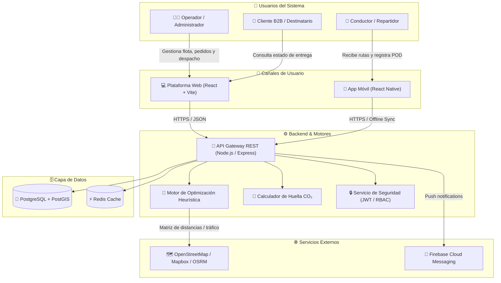

<div align="center">

# 🌿 EcoLogistica-Lima

### **Plataforma Inteligente Web y Móvil para la Gestión, Optimización Heurística y Logística Verde Urbana**

*Proyecto Final de Carrera (PFA) — Universidad Continental (2026)*  
*Código Institucional: **`PFA-ECOLIMA-2026`***

---

[](https://github.com/MartinezJhef/EcoLogistica-Lima)
[-3b82f6?style=for-the-badge&logo=scrumalliance&logoColor=white)](docs/01%20Inicio/01.%20Selecci%C3%B3n%20del%20enfoque%20del%20proyecto%20V_1_0_0.md)
[](docs/01%20Inicio/02.%20Acta%20de%20constituci%C3%B3n%20V_1_0_0.md)
[](docs/01%20Inicio/07.%20Requisitos%20no%20funcionales%20V_1_0_0.md)
[](https://github.com/MartinezJhef/EcoLogistica-Lima)

</div>

---

## 📑 Tabla de Contenidos

1. [🎯 Propósito y Visión del Proyecto](#-propósito-y-visión-del-proyecto)
2. [📊 Metas y Métricas de Impacto (KPIs)](#-metas-y-métricas-de-impacto-kpis)
3. [🏛️ Arquitectura del Sistema y Flujo Operativo](#️-arquitectura-del-sistema-y-flujo-operativo)
4. [🛠️ Stack Tecnológico](#️-stack-tecnológico)
5. [📐 Marco Metodológico Híbrido](#-marco-metodológico-híbrido)
6. [📚 Matriz Integral de Artefactos del Proyecto](#-matriz-integral-de-artefactos-del-proyecto)
   - [📍 Fase 01: Inicio (13 Documentos Normativos)](#-fase-01-inicio-13-documentos-normativos)
   - [📍 Fase 02: Planificación (4 Artefactos Ágiles y Jira)](#-fase-02-planificación-4-artefactos-ágiles-y-jira)
7. [👥 Directorio del Equipo de Proyecto](#-directorio-del-equipo-de-proyecto)
8. [🌳 Estrategia de Ramas y Flujo Git](#-estrategia-de-ramas-y-flujo-git)
9. [🚀 Puesta en Marcha y Navegación Local](#-puesta-en-marcha-y-navegación-local)

---

## 🎯 Propósito y Visión del Proyecto

El crecimiento acelerado del comercio electrónico en **Lima Metropolitana** ha intensificado la congestión vehicular, los retrasos en la última milla y la emisión desmedida de gases de efecto invernadero ($CO_2$). Los operadores logísticos tradicionales enfrentan pérdidas operativas y altos costos de combustible debido a rutas ineficientes, zonificaciones ambientales restrictivas y una nula trazabilidad de la huella de carbono.

**EcoLogistica-Lima** surge como una solución tecnológica integral de **Logística Verde Urbana (Green Urban Logistics)** que fusiona:

- 🧠 **Motor de Optimización Heurística de Rutas:** Algoritmos conscientes del tráfico metropolitano, capacidad volumétrica/peso (85%-90%) y restricciones ambientales por zona.
- 📱 **Aplicación Móvil de Campo (Mobile-First):** Asignación y navegación para repartidores con soporte offline ante cortes de conectividad y comprobación digital de entrega (POD con tolerancia geográfica de 100 m).
- 🖥️ **Panel Web de Monitoreo y Despacho:** Telemetría geoespacial en tiempo real, re-optimización dinámica ante eventos disruptivos y gestión de flotas multivehiculares.
- 🌱 **Módulo de Analítica y Compensación Ambiental:** Cuantificación estandarizada de emisiones según tipología vehicular ($E_{\text{real}} = d \times F_{\text{vehículo}} \times C_{\text{tráfico}}$) y planes de mitigación mediante créditos de carbono y arborización urbana local.

---

## 📊 Metas y Métricas de Impacto (KPIs)

| Indicador Clave (KPI) | Meta Comprometida | Mecanismo de Medición | Documento Fuente |
| :--- | :---: | :--- | :--- |
| **Reducción de Emisiones ($CO_2$)** | **-22%** | Comparativa entre línea base convencional y ruta optimizada verde | [RF-005 / RF-006](docs/01%20Inicio/06.%20Requisitos%20funcionales%20V_1_0_0.md) |
| **Tiempo de Cálculo del Ruteo** | **< 45 seg** | Procesamiento de hasta 150 pedidos y 15 vehículos en simultáneo | [RNF-001](docs/01%20Inicio/07.%20Requisitos%20no%20funcionales%20V_1_0_0.md) |
| **Cumplimiento de Ventanas SLA** | **≥ 95%** | Verificación de entregas dentro del rango horario comprometido | [RN-007](docs/01%20Inicio/09.%20Reglas%20de%20negocio%20V_1_0_0.md) |
| **Precisión de Geolocalización POD** | **≤ 100 m** | Tolerancia máxima de geocerca GPS para confirmación digital de entrega | [RN-006](docs/01%20Inicio/09.%20Reglas%20de%20negocio%20V_1_0_0.md) |
| **Disponibilidad de la Plataforma** | **≥ 99.5%** | Tiempo de actividad en infraestructura en la nube | [RNF-006](docs/01%20Inicio/07.%20Requisitos%20no%20funcionales%20V_1_0_0.md) |

---

## 🏛️ Arquitectura del Sistema y Flujo Operativo

El sistema sigue los principios del **Modelo C4** (Contexto, Contenedores, Componentes y Despliegue) para asegurar modularidad, seguridad, alta disponibilidad y desacoplamiento.



---

## 🛠️ Stack Tecnológico

| Capa / Componente | Tecnología Seleccionada | Justificación Técnica |
| :--- | :--- | :--- |
| **Frontend Web** | `React 18` + `TypeScript` + `Vite` | Renderizado rápido, tipado estricto y componentes modulares para dashboards de alta densidad. |
| **Aplicación Móvil** | `React Native` + `Expo` | Compatibilidad multiplataforma (Android/iOS), soporte para sensores GPS y almacenamiento local offline. |
| **Backend & API** | `Node.js` + `TypeScript` + `Express` | Modelo asíncrono no bloqueante ideal para peticiones I/O concurrentes y microservicios. |
| **Base de Datos** | `PostgreSQL 16` + `PostGIS` | Motor relacional robusto con extensiones geoespaciales nativas para cálculo de polígonos, geocercas y distancias. |
| **Servicios GIS** | `Leaflet` / `OpenStreetMap` / `OSRM` | Cartografía de código abierto, flexibilidad sin costos prohibitivos de licenciamiento por volumen. |
| **Contenedores & DevOps** | `Docker` + `Docker Compose` + `GitHub Actions` | Entornos estandarizados, integración continua (CI/CD) y despliegue automatizado sin discrepancias de entorno. |

---

## 📐 Marco Metodológico Híbrido

Conforme a la evaluación formal documentada en `01. Selección del enfoque del proyecto`:

$$\text{Promedio Likert} = \frac{3 + 4 + 2 + 4 + 5}{5} = 3.6 \implies \textbf{Perfil Metodológico HÍBRIDO}$$

```text
┌────────────────────────────────────────────────────────────────────────────┐
│                    ENFOQUE HÍBRIDO: EcoLogistica-Lima                      │
├─────────────────────────────────────┬──────────────────────────────────────┤
│    CAPA PREDICTIVA (PMBOK® 7ª Ed.)  │      CAPA ADAPTATIVA (Scrum / BDD)   │
├─────────────────────────────────────┼──────────────────────────────────────┤
│ • Plazo académico inamovible: 16 sem│ • Cadencia: 8 Sprints de 2 semanas   │
│ • Línea base de alcance y EDT/WBS   │ • Épicas, Historias de Usuario (US)  │
│ • Control presupuestal formal       │ • Criterios BDD en formato Gherkin   │
│ • Gobernanza y control de versiones │ • Definition of Done (DoD) estricto  │
│ • Mitigación predictiva de riesgos  │ • Tablero Scrum y Roadmap en Jira    │
└─────────────────────────────────────┴──────────────────────────────────────┘
```

---

## 📚 Matriz Integral de Artefactos del Proyecto

### 📍 Fase 01: Inicio (13 Documentos Normativos)

Toda la documentación base se encuentra estandarizada y auditada en el directorio [`docs/01 Inicio/`](docs/01%20Inicio):

| Código | Documento Oficial | Responsable | Enfoque / Contenido Clave |
| :---: | :--- | :--- | :--- |
| **01** | [Selección del enfoque del proyecto V_1_0_0.md](docs/01%20Inicio/01.%20Selecci%C3%B3n%20del%20enfoque%20del%20proyecto%20V_1_0_0.md) | Jheferson Martinez | Evaluación cuantitativa de 5 variables Likert, radar metodológico y justificación híbrida PMBOK 7ª Ed. |
| **02** | [Acta de constitución V_1_0_0.md](docs/01%20Inicio/02.%20Acta%20de%20constituci%C3%B3n%20V_1_0_0.md) | Zayuri Cerron | Carta formal del proyecto, objetivos SMART, cronograma macro (16 sem.), presupuesto y designación de autoridad. |
| **03** | [Declaración de la visión V_1_0_0.md](docs/01%20Inicio/03.%20Declaraci%C3%B3n%20de%20la%20visi%C3%B3n%20V_1_0_0.md) | Angela Rojas | Propuesta de valor bajo plantilla canónica de visión, diferenciadores estratégicos y metas de sostenibilidad. |
| **04** | [Registro de supuestos y restricciones V_1_0_0.md](docs/01%20Inicio/04.%20Registro%20de%20supuestos%20y%20restricciones%20V_1_0_0.md) | Maylit Mendoza | Catálogo de supuestos operativos y restricciones técnicas, normativas y financieras con niveles de criticidad. |
| **05** | [Registro de interesados V_1_0_0.md](docs/01%20Inicio/05.%20Registro%20de%20interesados%20V_1_0_0.md) | Diego Angulo | Identificación de 5 perfiles de interesados, matriz Poder vs. Interés y estrategia formal de comunicación. |
| **06** | [Requisitos funcionales V_1_0_0.md](docs/01%20Inicio/06.%20Requisitos%20funcionales%20V_1_0_0.md) | Maylit Mendoza | 10 Requisitos Funcionales (RF-001 a RF-010) con criterios de aceptación BDD Gherkin (Ruta Gold, Feliz e Infeliz). |
| **07** | [Requisitos no funcionales V_1_0_0.md](docs/01%20Inicio/07.%20Requisitos%20no%20funcionales%20V_1_0_0.md) | Diego Angulo | 7 Requisitos de calidad técnica bajo la norma internacional ISO/IEC 25010 (Rendimiento, Seguridad, etc.). |
| **08** | [Usuarios V_1_0_0.md](docs/01%20Inicio/08.%20Usuarios%20V_1_0_0.md) | Jheferson Martinez | Matriz de arquetipos de usuario: Administrador, Despachador, Conductor, Cliente B2B y Receptor final. |
| **09** | [Reglas de negocio V_1_0_0.md](docs/01%20Inicio/09.%20Reglas%20de%20negocio%20V_1_0_0.md) | Zayuri Cerron | 10 Reglas operativas (RN-001 a RN-010) con fórmulas de emisión, control de capacidad y matriz de trazabilidad cruzada. |
| **10** | [Stack tecnológico V_1_0_0.md](docs/01%20Inicio/10.%20Stack%20tecnol%C3%B3gico%20V_1_0_0.md) | Equipo de Desarrollo | Criterios de selección arquitectónica: Frontend, Backend, Base de datos, GIS, Seguridad y Contenedores. |
| **11** | [Base de datos V_1_0_0.md](docs/01%20Inicio/11.%20Base%20de%20datos%20V_1_0_0.md) | Equipo de Datos | Modelo Entidad-Relación y diccionario de datos relacional/geoespacial para flotas, pedidos, rutas y auditoría. |
| **12** | [Modelo C4 V_1_0_0.md](docs/01%20Inicio/12.%20Modelo%20C4%20V_1_0_0.md) | Equipo de Arquitectura | Diagramas de Contexto, Contenedores y Componentes para representar el desacoplamiento sistémico. |
| **13** | [Restricciones V_1_0_0.md](docs/01%20Inicio/13.%20Restricciones%20V_1_0_0.md) | Maylit Mendoza | Análisis multidimensional: seguridad ciudadana en Lima, costo de ciclo de vida (LCC), normativas ambientales y contexto social. |

---

### 📍 Fase 02: Planificación (4 Artefactos Ágiles y Jira)

Toda la descomposición técnica y parametrización ágil reside en [`docs/02 Planificación/`](docs/02%20Planificaci%C3%B3n):

| Código | Artefacto Oficial | Responsable | Enfoque / Contenido Clave |
| :---: | :--- | :--- | :--- |
| **01** | [Transformando a ágil V_1_0_0.md](docs/02%20Planificaci%C3%B3n/01%20Transformando%20a%20%C3%A1gil%20V_1_0_0.md) | Diego Angulo | Desglose formal de Épicas, User Stories (US), Enablers técnicos, criterios BDD, DoR y Definition of Done (DoD). |
| **02** | [Artefactos Jira V_1_0_0.md](docs/02%20Planificaci%C3%B3n/02%20Artefactos%20Jira%20V_1_0_0.md) | Zayuri Cerron | Evidencias visuales de Jira Software: Roadmap temporal, Backlog con Story Points, Sprint 1 Planning, Tablero Scrum y Release. |
| **03** | [Registro de riesgos V_1_0_0.md](docs/02%20Planificaci%C3%B3n/03%20Registro%20de%20riesgos%20V_1_0_0.md) | Maylit Mendoza | Matriz cuantitativa de riesgos (Probabilidad $\times$ Impacto = Severidad), disparadores, planes de mitigación y contingencia. |
| **04** | [Presupuesto del proyecto V_1_0_0.md](docs/02%20Planificaci%C3%B3n/04%20Presupuesto%20del%20proyecto%20V_1_0_0.md) | Jheferson Martinez | Presupuesto detallado y categorizado: Recursos humanos, infraestructura Cloud, licencias y reserva de contingencia. |

---

## 👥 Directorio del Equipo de Proyecto

<div align="center">

| Integrante | Rol Principal | Responsabilidad Metodológica |
| :--- | :--- | :--- |
| 👩‍💼 **Zayuri Cerron Medina** | **Directora de Proyecto (Project Manager)** | Gobernanza PMBOK, Acta de Constitución, Jira y Control de Reglas |
| 👨‍💻 **Jheferson Martinez Valerio** | **Líder Metodológico / Scrum Master** | Enfoque Híbrido, Presupuesto, Perfiles de Usuario y Repositorio Git |
| 👩‍🔬 **Angela Rojas Quispe** | **Product Owner / Analista de Negocio** | Declaración de la Visión, Definición de Épicas y Priorización de Backlog |
| 👩‍💻 **Maylit Mendoza Alarcon** | **Analista de Riesgos y QA** | Matriz de Riesgos, Especificación de RF (BDD), Restricciones y Supuestos |
| 👨‍💼 **Diego Angulo Gonzales** | **Gestor de Stakeholders & Comunicaciones** | Registro de Interesados, Requisitos No Funcionales (ISO) y Transformación Ágil |

</div>

---

## 🌳 Estrategia de Ramas y Flujo Git

El repositorio implementa una estrategia de ramificación basada en **GitFlow Adaptado** para asegurar la integridad de la línea base:

```text
  main (Producción y Entregables Consolidados)
   │
   ├── develop (Integración continua)
   │    │
   │    ├── feature/fase-01-inicio  <── [Consolidación completa de Fase 01 y Fase 02]
   │    └── feature/sprint-01       <── [En desarrollo activo]
   │
   └── release/v1.0.0 (Versión candidata final)
```

- **`main`**: Rama principal y protegida. Contiene únicamente versiones auditadas y aprobadas para evaluación institucional.
- **`feature/fase-01-inicio`**: Rama de trabajo histórica que consolida la documentación de Inicio y Planificación con sus evidencias.
- **Convención de Commits:** [Conventional Commits](https://www.conventionalcommits.org/) (`feat:`, `fix:`, `docs:`, `style:`, `refactor:`, `test:`, `chore:`).

---

## 🚀 Puesta en Marcha y Navegación Local

### Clonación del Repositorio
```bash
git clone https://github.com/MartinezJhef/EcoLogistica-Lima.git
cd EcoLogistica-Lima
```

### Navegación entre Ramas
```bash
# Ver el estado consolidado en main
git checkout main

# Explorar la rama de desarrollo de fase 01
git checkout feature/fase-01-inicio
```

### Visualización de Documentación en VS Code
Para una visualización enriquecida de las fórmulas matemáticas LaTeX ($$), tablas y diagramas Mermaid:
1. Instala la extensión **Markdown Preview Enhanced** o utiliza el visor nativo de VS Code (`Ctrl + Shift + V`).
2. Todos los documentos cuentan con navegación cruzada e hipervínculos relativos para saltar entre requisitos, reglas y código.

---

<div align="center">

**EcoLogistica-Lima** — *Innovación Tecnológica para una Logística Urbana Verde, Eficiente y Sostenible.*  
Universidad Continental · 2026

</div>
