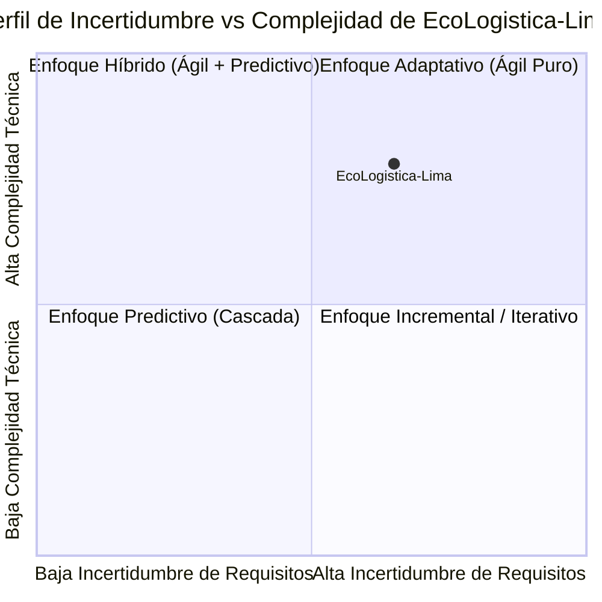

# Selección del Enfoque del Proyecto

---

## 1. Encabezado de Metadatos

| Campo | Detalle |
| :--- | :--- |
| **Nombre del Proyecto** | EcoLogistica-Lima: Plataforma Web y Móvil para la Gestión y Optimización de Logística Verde Urbana |
| **Código del Proyecto** | PFA-ECOLIMA-2026 |
| **Integrantes del Equipo** | • Zayuri Cerron Medina (Directora de Proyecto)<br>• Jheferson Martinez Valerio (Líder Metodológico / Scrum Master)<br>• Angela Rojas Quispe (Product Owner)<br>• Maylit Mendoza Alarcon (Analista de Riesgos / QA)<br>• Diego Angulo Gonzales (Gestor de Stakeholders y Comunicaciones) |
| **Responsable del Documento**| Jheferson Martinez Valerio |
| **Fecha de Elaboración** | 28 de agosto de 2026 |
| **Versión** | 1.0.0 |
| **Estado** | Aprobado |

---

## 2. Matriz de Ponderación de Variables

La selección del enfoque metodológico de gestión y desarrollo se fundamenta en la evaluación cuantitativa de las variables clave del proyecto, aplicando una escala Likert de 1 a 5 según los estándares del PMBOK® Guide 7ª Edición y el marco de desarrollo de software.

| ID | Variable de Evaluación | Ponderación (1 - 5) | Justificación Técnica y Análisis del Contexto |
| :---: | :--- | :---: | :--- |
| **VAR-01** | **Claridad y estabilidad de requisitos** | **3 / 5** | Si bien el objetivo central (optimización de rutas y cálculo de huella de carbono) está definido a nivel de negocio, los algoritmos de ruteo verde y la integración de APIs de tráfico en tiempo real para Lima Metropolitana demandarán refinamientos iterativos a partir del feedback de los usuarios finales y pruebas piloto. |
| **VAR-02** | **Complejidad técnica e innovación** | **4 / 5** | El proyecto involucra alta complejidad técnica: desarrollo multiplataforma (Web y Móvil), integración con servicios geoespaciales (GIS/OpenStreetMap/Google Maps), algoritmos heurísticos de ruteo de bajas emisiones y cálculo estandarizado de CO₂ conforme a factores de emisión vehiculares. |
| **VAR-03** | **Severidad del impacto ante cambios** | **2 / 5** | Al tratarse de una solución basada en arquitectura de microservicios desacoplada en la nube, el impacto de modificaciones en módulos específicos (ej. módulo de reportes o perfil de conductor) es controlado y no compromete la integridad global del sistema si se aplican prácticas de CI/CD. |
| **VAR-04** | **Disponibilidad de los interesados (stakeholders)** | **4 / 5** | Se cuenta con la participación activa y continua del equipo docente asesor, representantes de empresas de reparto urbano y conductores para revisiones quincenales, asegurando ciclos cortos de retroalimentación en cada hito del ciclo académico de 16 semanas. |
| **VAR-05** | **Frecuencia de entregas de valor** | **5 / 5** | El proyecto exige validación continua de incrementos de software funcionales. El cronograma académico estructurado en 16 semanas requiere demostraciones periódicas de módulos operativos (Módulo de autenticación, Motor de ruteo, App de conductor y Panel de analítica ambiental). |

---

## 3. Diagrama de Radar del Enfoque

### 3.1. Representación Gráfica del Perfil del Proyecto (Mermaid)



### 3.2. Tabla de Caracterización Multidimensional

```
                             [5] Frecuencia de Entregas
                                      ▲ (5/5)
                                     / \
                                    /   \
       (4/5) Disponibilidad        /  *  \        (3/5) Claridad de Requisitos
         de Stakeholders ◄--------*-------*--------►
                                   \     /
                                    \   /
                 (2/5) Impacto de    \ /   (4/5) Complejidad Técnica
                   Cambios            ▼
```

| Dimensión Evaluada | Puntuación | Tendencia Metodológica |
| :--- | :---: | :--- |
| **Claridad de Requisitos** | 3.0 | Híbrida (Base clara con evolución adaptativa) |
| **Complejidad Técnica** | 4.0 | Ágil / Adaptativa (Desarrollo por prototipos e incrementos) |
| **Impacto de Cambios** | 2.0 | Ágil (Arquitectura modular tolerante a cambios) |
| **Disponibilidad de Stakeholders** | 4.0 | Ágil (Colaboración continua en Sprints) |
| **Frecuencia de Entregas** | 5.0 | Ágil (Sprints quincenales de entrega de valor) |
| **Restricción de Plazo Académico (16 semanas)** | 5.0 | Predictiva (Hitos y fechas límite institucionales fijas) |

---

## 4. Decisión y Justificación del Enfoque

### 4.1. Declaración Explícita del Enfoque Seleccionado
Se selecciona de manera oficial el **ENFOQUE HÍBRIDO (Predictivo - Adaptativo)** para la gestión y ejecución del proyecto **EcoLogistica-Lima**.

### 4.2. Justificación Técnica Alineada al PMBOK® 7ª Edición

Conforme al *Dominio de Desempeño del Enfoque de Desarrollo y Cadencia de Entrega* del PMBOK 7ª Edición, la combinación estructurada de modelos predictivos y ágiles responde de forma óptima a las restricciones del proyecto:

1. **Capa Predictiva (Gobernanza y Gestión Global):**
   * **Control de Plazo Fijo:** La duración total de **16 semanas** del ciclo académico y las fechas de entrega institucional son inamovibles. El enfoque predictivo proporciona una Estructura de Desglose del Trabajo (EDT/WBS), una línea base de cronograma y un control de hitos macro inviolables.
   * **Gestión Formal de Costos y Calidad:** El presupuesto inicial, los criterios de aceptación y las políticas de calidad se gobiernan bajo estándares formales para asegurar el cumplimiento del estándar de titulación.

2. **Capa Adaptativa / Ágil (Desarrollo de Software e Ingeniería):**
   * **Marco Scrum + Kanban:** El ciclo de vida de desarrollo de software se ejecutará en **Sprints de 2 semanas**, permitiendo la planificación, desarrollo, pruebas automatizadas y revisión de incrementos de producto potencialmente desplegables.
   * **Mitigación de Riesgos Técnicos:** La complejidad de los algoritmos de optimización de rutas y la sincronización web/móvil se aborda mediante refinamientos continuos de backlog, integración continua y retroalimentación directa con los usuarios piloto.

Esta sinergia híbrida garantiza la **rigurosidad en el control y cumplimiento de plazos institucionales** sin sacrificar la **flexibilidad y velocidad de innovación** requeridas para una plataforma tecnológica de impacto ecológico urbano.
