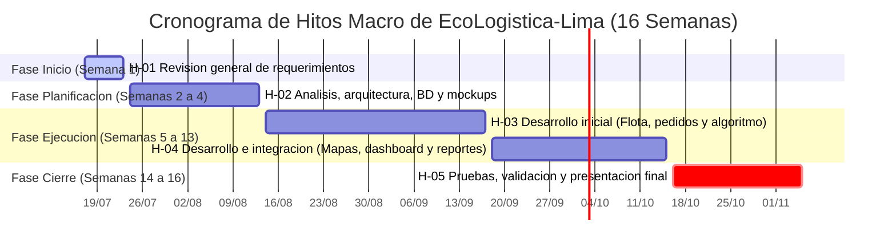

[← Volver al README Principal](../../README.md)

# 02. Acta de Constitución del Proyecto (Project Charter)

---

## 1. Información del documento

| Campo | Detalle |
| :--- | :--- |
| **Nombre del Proyecto** | EcoLogistica-Lima: Plataforma Web y Móvil para la Gestión y Optimización de Logística Verde Urbana |
| **Código del Proyecto** | PFA-ECOLIMA-2026 |
| **Integrantes del Equipo** | • Zayuri Cerron Medina  • Jheferson Martinez Valerio  • Angela Rojas Quispe  • Maylit Mendoza Alarcon  • Diego Angulo Gonzales  |
| **Responsable del Documento**| Zayuri Cerron Medina |
| **Fecha de Elaboración** | 28 de agosto de 2026 |
| **Versión** | 1.0.0 |

---

## 2. Propósito y Justificación del Proyecto

### 2.1. Problema de Negocio / Contexto Urbano
Lima Metropolitana presenta uno de los niveles más críticos de congestión vehicular y contaminación atmosférica en América Latina. El crecimiento acelerado del comercio electrónico ha incrementado de manera exponencial las operaciones de reparto de "última milla", caracterizadas por:
Rutas ineficientes y fragmentadas que incrementan los costos de combustible y los tiempos de entrega.
Uso predominante de vehículos a combustión obsoletos y no regulados, con alta emisión de material particulado y dióxido de carbono ($CO_2$).
Ausencia de herramientas tecnológicas accesibles para que pequeñas y medianas empresas (PyMEs) logísticas planifiquen rutas ecológicas, integren vehículos sostenibles (bicicletas de carga, motos eléctricas) y certifiquen su huella de carbono ante clientes cada vez más conscientes del impacto ambiental.

### 2.2. Oportunidad y Propósito
**EcoLogistica-Lima** nace con el propósito de transformar la logística urbana limeña en un ecosistema inteligente y sostenible. La plataforma permitirá a los operadores logísticos y comercios reducir hasta un 25% sus emisiones de $CO_2$, disminuir costos de combustible mediante optimización heurística de rutas verdes, y brindar a conductores y consumidores trazabilidad ambiental transparente en tiempo real.

---

## 3. Objetivos Medibles del Proyecto (Criterios SMART)

| Dimensión | Objetivo SMART | Métrica / Criterio de Éxito |
| :--- | :--- | :--- |
| **Alcance** | Desarrollar, integrar y desplegar un ecosistema digital compuesto por una aplicación móvil (Android) para conductores y un panel web administrativo para despachadores que cubra el 100% de las historias de usuario prioritarias del backlog. | 100% de módulos core operativos (Ruteo verde, Tracking, Cálculo de $CO_2$, Panel analítico) validados en ambiente productivo al cierre de la Semana 16. |
| **Cronograma** | Ejecutar y completar el ciclo de vida del proyecto en un horizonte estricto de **16 semanas académicas**, distribuidas en 8 sprints quincenales, sin desviaciones mayores a 3 días hábiles en los hitos de entrega institucional. | Índice de Desempeño del Cronograma ($SPI \ge 0.95$) y entrega formal del producto en Semana 16. |
| **Costo** | Administrar y ejecutar el presupuesto preliminar asignado de **S/ 12,850.00 PEN**, controlando los costos de infraestructura cloud, licencias de geolocalización y herramientas operativas. | Índice de Desempeño del Costo ($CPI$) comprendido entre $0.95 \le CPI \le 1.05$ al cierre del proyecto. |
| **Calidad** | Asegurar una arquitectura de software robusta, segura y usable que cumpla con los estándares de ingeniería de software. | Cobertura de pruebas unitarias/integración $\ge 80\%$, tiempo de respuesta de endpoints de ruteo $< 350\text{ ms}$ y puntaje de usabilidad System Usability Scale ($SUS \ge 85/100$). |

---

## 4. Requisitos de Alto Nivel del Producto

### 4.1 Funcionalidades Clave (Requisitos Funcionales Principales)
* **Gestión de Envíos y Monitoreo en Tiempo Real:** Creación, asignación, seguimiento de estado y trazabilidad en vivo de los paquetes y entregas ecológicas a lo largo de las rutas definidas.
* **Optimización de Rutas Ecológicas:** Algoritmo/motor para el cálculo de rutas óptimas orientado a reducir tiempos de tránsito y minimizar la huella de carbono/emisiones en Lima Metropolitana.
* **Gestión de Vehículos y Flota Ecológica:** Registro, mantenimiento y asignación eficiente de la flota de transporte sostenible (bicicletas, vehículos eléctricos, scooters, etc.).
* **Módulo de Métricas e Impacto Sostenible:** Panel de control (*dashboard*) para el cálculo y reporte automatizado de ahorro de CO2 y métricas de eficiencia operativa.
* **Gestión de Usuarios, Roles y Notificaciones:** Control de acceso basado en roles (Administrador, Conductor/Repartidor, Cliente) y envío de notificaciones sobre el estado de los pedidos.

### 4.2 Limitaciones Técnicas Iniciales (Requisitos No Funcionales y Restricciones Principales)
* **Rendimiento y Tiempo de Respuesta:** El sistema debe responder a las peticiones del usuario en un tiempo promedio menor a 2 segundos bajo condiciones normales de carga.
* **Disponibilidad y Concurrencia:** Alta disponibilidad operativa (mínimo 99.5% de *uptime*) garantizando soporte para operaciones continuas en horas pico.
* **Seguridad y Protección de Datos:** Encriptación de datos sensibles en tránsito (TLS/HTTPS) y en reposo, garantizando el cumplimiento de la Ley de Protección de Datos Personales (Ley N° 29733).
* **Compatibilidad y Escalabilidad:** Arquitectura basada en microservicios/APIs que garantice la interoperabilidad con plataformas externas y facilite el escalamiento horizontal.
* **Limitaciones de Infraestructura Inicial:** Restricciones presupuestarias y de infraestructura en la nube durante la fase inicial (MVP), limitando la capacidad de procesamiento concurrente masivo en la primera versión.

---

## 5. Riesgos Macro del Proyecto

| ID | Riesgo Identificado | Probabilidad | Impacto | Severidad | Estrategia de Mitigación / Contingencia |
| :---: | :--- | :---: | :---: | :---: | :--- |
| **RSK-01** | Variabilidad o latencia excesiva en APIs públicas/gratuitas de mapas y geolocalización. | Media | Alto | **Alta** | Implementación de capa de caché geoespacial local (Redis) y arquitectura con soporte fallback a OpenStreetMap/GraphHopper. |
| **RSK-02** | Desalineación temporal en el cronograma estricto de 16 semanas por sobrecarga académica. | Media | Alto | **Alta** | Aplicación de metodología Scrum con Sprints quincenales, priorización estricta MoSCoW en el Product Backlog y reuniones diarias de sincronización (Dailies de 15 min). |
| **RSK-03** | Falta de datos oficiales actualizados sobre factores de emisión vehicular en el parque automotor de Lima. | Baja | Medio | **Media** | Utilización de factores de emisión estandarizados por el Ministerio del Ambiente (MINAM) y guías internacionales IPCC para transporte urbano. |
| **RSK-04** | Dificultad para pruebas en campo con repartidores reales durante la fase piloto. | Media | Medio | **Media** | Establecimiento de convenios tempranos en Semana 04 con 2 microempresas de courier local y simulación controlada de rutas con telemetría mockeada. |

---

## 6. Resumen del Cronograma de Hitos Clave (Horizonte: 16 Semanas)

| ID | Hito | Periodo |
| :--- | :--- | :--- |
| H-01 | Revisión general de requerimientos del proyecto | Semana 1 |
| H-02 | Análisis de requerimientos, diseño de BD, arquitectura y mockups | Semanas 2-4 |
| H-03 | Desarrollo inicial (Gestión de flota, pedidos y algoritmo básico) | Semanas 5-9 |
| H-04 | Desarrollo e integración (Mapas, dashboard, reportes y optimización) | Semanas 10-13 |
| H-05 | Pruebas del sistema, validación y presentación final del PMV | Semanas 14-16 |

---

## 7. Presupuesto Estimado Inicial

| Categoría de Gasto | Conceptos Incluidos | Monto Estimado (S/) |
| :--- | :--- | ---: |
| **Recursos Humanos (CAPEX)** | Personal técnico, desarrollo y gestión (1,200 h referenciales) | S/ 7,875.00 |
| **Licenciamiento y Herramientas** | Dominio web, servicios auxiliares y cuotas de APIs de mapas | S/ 375.00 |
| **Infraestructura Cloud (OPEX)** | Servidores Backend, PostgreSQL/PostGIS, Redis y monitoreo | S/ 2,175.00 |
| **Reserva de Contingencia (10%)** | Fondo para imprevistos técnicos y mitigación de riesgos | S/ 1,042.50 |
| **Presupuesto Total Asignado** | **Límite presupuestal máximo del proyecto (16 semanas)** | **S/ 12,850.00** |

---
[← Volver al README Principal](../../README.md)