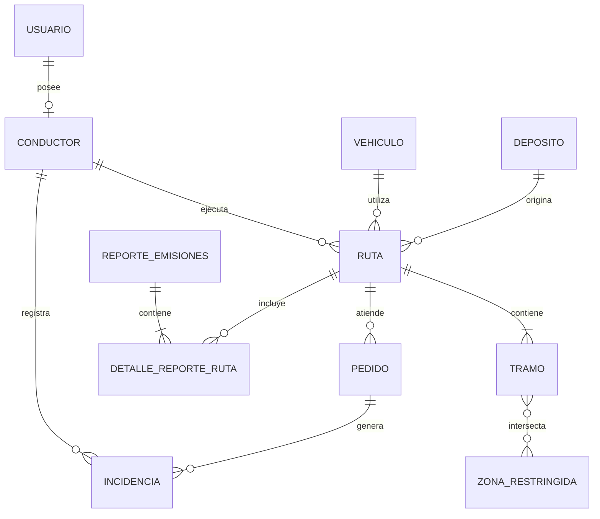

[← Volver al README Principal](../../README.md)

# 11. Base de Datos

## 1. Datos generales

| Campo | Información |
|---|---|
| **Proyecto** | EcoLogística Lima – Optimizador de Rutas Sostenibles para DistriRápido S.A.C. |
| **Código del Proyecto** | PFA-ECOLIMA-2026 |
| **Responsable** | Jheferson Martinez Valerio |
| **Integrantes del Equipo** | • Zayuri Cerron Medina (Directora de Proyecto)<br>• Jheferson Martinez Valerio (Líder Metodológico / Scrum Master)<br>• Angela Rojas Quispe (Product Owner)<br>• Maylit Mendoza Alarcon (Analista de Riesgos / QA)<br>• Diego Angulo Gonzales (Gestor de Stakeholders y Comunicaciones) |
| **Fecha** | 17/09/2026 |
| **Versión** | 1.1.0 |
| **Estado** | Aprobado |

---

# 2. Modelo Conceptual — Diagrama Entidad-Relación

El modelo conceptual representa las entidades necesarias para gestionar la operación logística de DistriRápido S.A.C., considerando la asignación de conductores y vehículos, planificación de rutas, distribución de pedidos, control de incidencias y generación de indicadores de emisiones.

El diseño también contempla información geoespacial para representar depósitos, ubicaciones de entrega, tramos recorridos y zonas restringidas.

### Relaciones principales

- Un **USUARIO** puede tener un **CONDUCTOR** asociado (1:1 opcional).
- Un **CONDUCTOR** puede ejecutar múltiples **RUTAS** (1:N).
- Un **VEHICULO** puede ser asignado a múltiples **RUTAS** (1:N).
- Un **DEPOSITO** puede ser origen y retorno de múltiples **RUTAS** (1:N).
- Una **RUTA** contiene múltiples **TRAMOS** (1:N).
- Una **RUTA** puede atender múltiples **PEDIDOS** (1:N).
- Un **PEDIDO** puede generar múltiples **INCIDENCIAS** (1:N).
- Un **CONDUCTOR** puede registrar múltiples **INCIDENCIAS** (1:N).
- Una **RUTA** puede relacionarse con múltiples **REPORTES_EMISIONES** mediante **DETALLE_REPORTE_RUTA** (N:M).
- Un **TRAMO** puede intersectar una o múltiples **ZONAS_RESTRINGIDAS**.


---

# 3. Modelo Lógico — Especificación de Entidades

Nivel de normalización alcanzado: **Tercera Forma Normal (3FN)**.

El modelo lógico transforma las entidades identificadas en el modelo conceptual en tablas estructuradas, definiendo sus atributos, tipos de datos, claves primarias, claves foráneas y principales restricciones de integridad.

## USUARIO

| Atributo | Tipo | Restricción |
|---|---|---|
| usuario_id | UUID | PK |
| email | VARCHAR(255) | NOT NULL, UNIQUE |
| password_hash | VARCHAR(255) | NOT NULL |
| rol | VARCHAR(20) | NOT NULL, valores permitidos: ADMIN / OPERADOR / CONDUCTOR / AUDITOR |
| estado | VARCHAR(20) | NOT NULL, DEFAULT 'ACTIVO' |
| creado_en | TIMESTAMP WITH TIME ZONE | NOT NULL, DEFAULT CURRENT_TIMESTAMP |

## CONDUCTOR

| Atributo | Tipo | Restricción |
|---|---|---|
| conductor_id | UUID | PK |
| usuario_id | UUID | FK → USUARIO(usuario_id), UNIQUE, NOT NULL |
| nombres | VARCHAR(100) | NOT NULL |
| apellidos | VARCHAR(100) | NOT NULL |
| licencia | VARCHAR(20) | NOT NULL, UNIQUE |
| telefono | VARCHAR(15) | NOT NULL |
| estado | VARCHAR(20) | NOT NULL, DEFAULT 'DISPONIBLE' |

## VEHICULO

| Atributo | Tipo | Restricción |
|---|---|---|
| vehiculo_id | UUID | PK |
| placa | VARCHAR(10) | NOT NULL, UNIQUE |
| marca_modelo | VARCHAR(100) | NOT NULL |
| capacidad_peso_kg | DECIMAL(10,2) | NOT NULL, > 0 |
| capacidad_volumen_m3 | DECIMAL(10,2) | NOT NULL, > 0 |
| tipo_combustible | VARCHAR(30) | NOT NULL |
| factor_emision_co2 | DECIMAL(8,4) | NOT NULL, > 0 |
| estado | VARCHAR(20) | NOT NULL, DEFAULT 'DISPONIBLE' |

## DEPOSITO

| Atributo | Tipo | Restricción |
|---|---|---|
| deposito_id | UUID | PK |
| nombre | VARCHAR(150) | NOT NULL |
| direccion | TEXT | NOT NULL |
| ubicacion_geografica | GEOMETRY(Point, 4326) | NOT NULL |
| estado | VARCHAR(20) | NOT NULL, DEFAULT 'OPERATIVO' |

## PEDIDO

| Atributo | Tipo | Restricción |
|---|---|---|
| pedido_id | UUID | PK |
| ruta_id | UUID | FK → RUTA(ruta_id), NULL |
| codigo_seguimiento | VARCHAR(30) | NOT NULL, UNIQUE |
| cliente_nombre | VARCHAR(200) | NOT NULL |
| direccion_destino | TEXT | NOT NULL |
| ubicacion_destino | GEOMETRY(Point, 4326) | NOT NULL |
| peso_kg | DECIMAL(10,2) | NOT NULL, > 0 |
| volumen_m3 | DECIMAL(10,2) | NOT NULL, > 0 |
| ventana_inicio | TIME | NOT NULL |
| ventana_fin | TIME | NOT NULL |
| prioridad | VARCHAR(20) | NOT NULL, DEFAULT 'ESTANDAR' |
| estado | VARCHAR(20) | NOT NULL, DEFAULT 'PENDIENTE' |
| creado_en | TIMESTAMP WITH TIME ZONE | NOT NULL, DEFAULT CURRENT_TIMESTAMP |

> **Nota:** `ruta_id` permite que un pedido permanezca inicialmente sin ruta (`NULL`) y posteriormente sea asociado a una ruta durante la planificación logística.

## RUTA

| Atributo | Tipo | Restricción |
|---|---|---|
| ruta_id | UUID | PK |
| deposito_origen_id | UUID | FK → DEPOSITO(deposito_id), NOT NULL |
| conductor_id | UUID | FK → CONDUCTOR(conductor_id), NOT NULL |
| vehiculo_id | UUID | FK → VEHICULO(vehiculo_id), NOT NULL |
| fecha_operacion | DATE | NOT NULL |
| distancia_total_km | DECIMAL(10,2) | DEFAULT 0.00 |
| tiempo_total_min | INTEGER | DEFAULT 0 |
| co2_total_kg | DECIMAL(10,2) | DEFAULT 0.00 |
| estado | VARCHAR(20) | NOT NULL, DEFAULT 'PLANIFICADA' |
| creada_en | TIMESTAMP WITH TIME ZONE | NOT NULL, DEFAULT CURRENT_TIMESTAMP |

## TRAMO

| Atributo | Tipo | Restricción |
|---|---|---|
| tramo_id | UUID | PK |
| ruta_id | UUID | FK → RUTA(ruta_id), NOT NULL |
| orden_secuencia | INTEGER | NOT NULL, > 0 |
| origen_geometria | GEOMETRY(Point, 4326) | NOT NULL |
| destino_geometria | GEOMETRY(Point, 4326) | NOT NULL |
| distancia_tramo_km | DECIMAL(8,2) | NOT NULL, >= 0 |
| tiempo_estimado_min | DECIMAL(8,2) | NOT NULL, >= 0 |
| co2_tramo_kg | DECIMAL(8,2) | NOT NULL, >= 0 |
| geometria_linea | GEOMETRY(LineString, 4326) | NULL |
| | | UNIQUE(ruta_id, orden_secuencia) |

## ZONA_RESTRINGIDA

| Atributo | Tipo | Restricción |
|---|---|---|
| zona_id | UUID | PK |
| nombre | VARCHAR(150) | NOT NULL |
| motivo | VARCHAR(100) | NOT NULL |
| poligono_geografico | GEOMETRY(Polygon, 4326) | NOT NULL |
| hora_inicio_restriccion | TIME | NULL |
| hora_fin_restriccion | TIME | NULL |
| activa | BOOLEAN | NOT NULL, DEFAULT TRUE |

## INCIDENCIA

| Atributo | Tipo | Restricción |
|---|---|---|
| incidencia_id | UUID | PK |
| pedido_id | UUID | FK → PEDIDO(pedido_id), NOT NULL |
| conductor_id | UUID | FK → CONDUCTOR(conductor_id), NOT NULL |
| tipo_incidencia | VARCHAR(50) | NOT NULL |
| descripcion | TEXT | NULL |
| ubicacion_reporte | GEOMETRY(Point, 4326) | NULL |
| reportada_en | TIMESTAMP WITH TIME ZONE | NOT NULL, DEFAULT CURRENT_TIMESTAMP |

## REPORTE_EMISIONES

| Atributo | Tipo | Restricción |
|---|---|---|
| reporte_id | UUID | PK |
| titulo | VARCHAR(200) | NOT NULL |
| fecha_inicio_periodo | DATE | NOT NULL |
| fecha_fin_periodo | DATE | NOT NULL |
| total_co2_emitido_kg | DECIMAL(12,2) | NOT NULL, >= 0 |
| total_co2_ahorrado_kg | DECIMAL(12,2) | NOT NULL, >= 0 |
| generado_por_usuario | UUID | FK → USUARIO(usuario_id), NOT NULL |
| generado_en | TIMESTAMP WITH TIME ZONE | NOT NULL, DEFAULT CURRENT_TIMESTAMP |

## DETALLE_REPORTE_RUTA

Tabla intermedia utilizada para implementar la relación **N:M entre REPORTE_EMISIONES y RUTA**.

| Atributo | Tipo | Restricción |
|---|---|---|
| reporte_id | UUID | PK, FK → REPORTE_EMISIONES(reporte_id) |
| ruta_id | UUID | PK, FK → RUTA(ruta_id) |

---

# 4. Modelo Físico — DDL SQL e Índices

El modelo físico implementa las entidades del modelo lógico utilizando **PostgreSQL 16+** y **PostGIS** para el almacenamiento y procesamiento de información geoespacial.

Se utilizan UUID como identificadores, restricciones de integridad, claves foráneas, índices convencionales e índices espaciales mediante GiST.

```sql
-- =============================================================================
-- EcoLogística Lima - PFA-ECOLIMA-2026
-- Modelo Físico de Base de Datos
-- Versión: 1.1.0
-- Motor: PostgreSQL 16+
-- Extensión geoespacial: PostGIS
-- Normalización: 3FN
-- =============================================================================


-- =============================================================================
-- 1. EXTENSIONES
-- =============================================================================

CREATE EXTENSION IF NOT EXISTS "pgcrypto";
CREATE EXTENSION IF NOT EXISTS "postgis";


-- =============================================================================
-- 2. TABLA: usuarios
-- =============================================================================

CREATE TABLE usuarios (
    usuario_id UUID PRIMARY KEY DEFAULT gen_random_uuid(),

    email VARCHAR(255) NOT NULL UNIQUE,

    password_hash VARCHAR(255) NOT NULL,

    rol VARCHAR(20) NOT NULL
        CHECK (
            rol IN (
                'ADMIN',
                'OPERADOR',
                'CONDUCTOR',
                'AUDITOR'
            )
        ),

    estado VARCHAR(20) NOT NULL DEFAULT 'ACTIVO'
        CHECK (
            estado IN (
                'ACTIVO',
                'INACTIVO',
                'BLOQUEADO'
            )
        ),

    creado_en TIMESTAMP WITH TIME ZONE
        NOT NULL DEFAULT CURRENT_TIMESTAMP
);

CREATE INDEX idx_usuarios_email
    ON usuarios(email);

CREATE INDEX idx_usuarios_rol
    ON usuarios(rol);

CREATE INDEX idx_usuarios_estado
    ON usuarios(estado);


-- =============================================================================
-- 3. TABLA: conductores
-- =============================================================================

CREATE TABLE conductores (
    conductor_id UUID PRIMARY KEY DEFAULT gen_random_uuid(),

    usuario_id UUID NOT NULL UNIQUE
        REFERENCES usuarios(usuario_id)
        ON DELETE CASCADE,

    nombres VARCHAR(100) NOT NULL,

    apellidos VARCHAR(100) NOT NULL,

    licencia VARCHAR(20) NOT NULL UNIQUE,

    telefono VARCHAR(15) NOT NULL,

    estado VARCHAR(20) NOT NULL DEFAULT 'DISPONIBLE'
        CHECK (
            estado IN (
                'DISPONIBLE',
                'EN_RUTA',
                'LICENCIA'
            )
        )
);

CREATE INDEX idx_conductores_usuario
    ON conductores(usuario_id);

CREATE INDEX idx_conductores_estado
    ON conductores(estado);


-- =============================================================================
-- 4. TABLA: vehiculos
-- =============================================================================

CREATE TABLE vehiculos (
    vehiculo_id UUID PRIMARY KEY DEFAULT gen_random_uuid(),

    placa VARCHAR(10) NOT NULL UNIQUE,

    marca_modelo VARCHAR(100) NOT NULL,

    capacidad_peso_kg DECIMAL(10,2) NOT NULL
        CHECK (capacidad_peso_kg > 0),

    capacidad_volumen_m3 DECIMAL(10,2) NOT NULL
        CHECK (capacidad_volumen_m3 > 0),

    tipo_combustible VARCHAR(30) NOT NULL
        CHECK (
            tipo_combustible IN (
                'DIESEL',
                'GASOLINA',
                'GNV',
                'ELECTRICO'
            )
        ),

    factor_emision_co2 DECIMAL(8,4) NOT NULL
        CHECK (factor_emision_co2 > 0),

    estado VARCHAR(20) NOT NULL DEFAULT 'DISPONIBLE'
        CHECK (
            estado IN (
                'DISPONIBLE',
                'EN_RUTA',
                'MANTENIMIENTO'
            )
        )
);

CREATE INDEX idx_vehiculos_placa
    ON vehiculos(placa);

CREATE INDEX idx_vehiculos_estado
    ON vehiculos(estado);

CREATE INDEX idx_vehiculos_combustible
    ON vehiculos(tipo_combustible);


-- =============================================================================
-- 5. TABLA: depositos
-- =============================================================================

CREATE TABLE depositos (
    deposito_id UUID PRIMARY KEY DEFAULT gen_random_uuid(),

    nombre VARCHAR(150) NOT NULL,

    direccion TEXT NOT NULL,

    ubicacion_geografica GEOMETRY(Point, 4326) NOT NULL,

    estado VARCHAR(20) NOT NULL DEFAULT 'OPERATIVO'
        CHECK (
            estado IN (
                'OPERATIVO',
                'INACTIVO'
            )
        )
);

CREATE INDEX idx_depositos_estado
    ON depositos(estado);

CREATE INDEX idx_depositos_ubicacion_gist
    ON depositos
    USING GIST(ubicacion_geografica);


-- =============================================================================
-- 6. TABLA: rutas
-- =============================================================================

CREATE TABLE rutas (
    ruta_id UUID PRIMARY KEY DEFAULT gen_random_uuid(),

    deposito_origen_id UUID NOT NULL
        REFERENCES depositos(deposito_id),

    conductor_id UUID NOT NULL
        REFERENCES conductores(conductor_id),

    vehiculo_id UUID NOT NULL
        REFERENCES vehiculos(vehiculo_id),

    fecha_operacion DATE NOT NULL,

    distancia_total_km DECIMAL(10,2)
        NOT NULL DEFAULT 0.00
        CHECK (distancia_total_km >= 0),

    tiempo_total_min INTEGER
        NOT NULL DEFAULT 0
        CHECK (tiempo_total_min >= 0),

    co2_total_kg DECIMAL(10,2)
        NOT NULL DEFAULT 0.00
        CHECK (co2_total_kg >= 0),

    estado VARCHAR(20) NOT NULL DEFAULT 'PLANIFICADA'
        CHECK (
            estado IN (
                'PLANIFICADA',
                'EN_PROCESO',
                'FINALIZADA',
                'CANCELADA'
            )
        ),

    creada_en TIMESTAMP WITH TIME ZONE
        NOT NULL DEFAULT CURRENT_TIMESTAMP
);

CREATE INDEX idx_rutas_deposito
    ON rutas(deposito_origen_id);

CREATE INDEX idx_rutas_conductor
    ON rutas(conductor_id);

CREATE INDEX idx_rutas_vehiculo
    ON rutas(vehiculo_id);

CREATE INDEX idx_rutas_fecha
    ON rutas(fecha_operacion);

CREATE INDEX idx_rutas_estado
    ON rutas(estado);


-- =============================================================================
-- 7. TABLA: pedidos
-- =============================================================================

CREATE TABLE pedidos (
    pedido_id UUID PRIMARY KEY DEFAULT gen_random_uuid(),

    ruta_id UUID
        REFERENCES rutas(ruta_id)
        ON DELETE SET NULL,

    codigo_seguimiento VARCHAR(30) NOT NULL UNIQUE,

    cliente_nombre VARCHAR(200) NOT NULL,

    direccion_destino TEXT NOT NULL,

    ubicacion_destino GEOMETRY(Point, 4326) NOT NULL,

    peso_kg DECIMAL(10,2) NOT NULL
        CHECK (peso_kg > 0),

    volumen_m3 DECIMAL(10,2) NOT NULL
        CHECK (volumen_m3 > 0),

    ventana_inicio TIME NOT NULL,

    ventana_fin TIME NOT NULL,

    prioridad VARCHAR(20) NOT NULL DEFAULT 'ESTANDAR'
        CHECK (
            prioridad IN (
                'ALTA',
                'ESTANDAR',
                'BAJA'
            )
        ),

    estado VARCHAR(20) NOT NULL DEFAULT 'PENDIENTE'
        CHECK (
            estado IN (
                'PENDIENTE',
                'ASIGNADO',
                'EN_RUTA',
                'ENTREGADO',
                'FALLIDO'
            )
        ),

    creado_en TIMESTAMP WITH TIME ZONE
        NOT NULL DEFAULT CURRENT_TIMESTAMP,

    CONSTRAINT chk_ventana_tiempo
        CHECK (ventana_fin > ventana_inicio)
);

CREATE INDEX idx_pedidos_ruta
    ON pedidos(ruta_id);

CREATE INDEX idx_pedidos_estado
    ON pedidos(estado);

CREATE INDEX idx_pedidos_prioridad
    ON pedidos(prioridad);

CREATE INDEX idx_pedidos_codigo
    ON pedidos(codigo_seguimiento);

CREATE INDEX idx_pedidos_ubicacion_gist
    ON pedidos
    USING GIST(ubicacion_destino);


-- =============================================================================
-- 8. TABLA: tramos
-- =============================================================================

CREATE TABLE tramos (
    tramo_id UUID PRIMARY KEY DEFAULT gen_random_uuid(),

    ruta_id UUID NOT NULL
        REFERENCES rutas(ruta_id)
        ON DELETE CASCADE,

    orden_secuencia INTEGER NOT NULL
        CHECK (orden_secuencia > 0),

    origen_geometria GEOMETRY(Point, 4326) NOT NULL,

    destino_geometria GEOMETRY(Point, 4326) NOT NULL,

    distancia_tramo_km DECIMAL(8,2) NOT NULL
        CHECK (distancia_tramo_km >= 0),

    tiempo_estimado_min DECIMAL(8,2) NOT NULL
        CHECK (tiempo_estimado_min >= 0),

    co2_tramo_kg DECIMAL(8,2) NOT NULL
        CHECK (co2_tramo_kg >= 0),

    geometria_linea GEOMETRY(LineString, 4326),

    CONSTRAINT uk_tramo_ruta_secuencia
        UNIQUE (
            ruta_id,
            orden_secuencia
        )
);

CREATE INDEX idx_tramos_ruta
    ON tramos(ruta_id);

CREATE INDEX idx_tramos_linea_gist
    ON tramos
    USING GIST(geometria_linea);

CREATE INDEX idx_tramos_origen_gist
    ON tramos
    USING GIST(origen_geometria);

CREATE INDEX idx_tramos_destino_gist
    ON tramos
    USING GIST(destino_geometria);


-- =============================================================================
-- 9. TABLA: zonas_restringidas
-- =============================================================================

CREATE TABLE zonas_restringidas (
    zona_id UUID PRIMARY KEY DEFAULT gen_random_uuid(),

    nombre VARCHAR(150) NOT NULL,

    motivo VARCHAR(100) NOT NULL,

    poligono_geografico GEOMETRY(Polygon, 4326) NOT NULL,

    hora_inicio_restriccion TIME,

    hora_fin_restriccion TIME,

    activa BOOLEAN NOT NULL DEFAULT TRUE
);

CREATE INDEX idx_zonas_estado
    ON zonas_restringidas(activa);

CREATE INDEX idx_zonas_poligono_gist
    ON zonas_restringidas
    USING GIST(poligono_geografico);


-- =============================================================================
-- 10. TABLA: incidencias
-- =============================================================================

CREATE TABLE incidencias (
    incidencia_id UUID PRIMARY KEY DEFAULT gen_random_uuid(),

    pedido_id UUID NOT NULL
        REFERENCES pedidos(pedido_id),

    conductor_id UUID NOT NULL
        REFERENCES conductores(conductor_id),

    tipo_incidencia VARCHAR(50) NOT NULL
        CHECK (
            tipo_incidencia IN (
                'TRAFICO_EXCESIVO',
                'CLIENTE_AUSENTE',
                'VEHICULO_AVERIA',
                'CLIMA',
                'OTRO'
            )
        ),

    descripcion TEXT,

    ubicacion_reporte GEOMETRY(Point, 4326),

    reportada_en TIMESTAMP WITH TIME ZONE
        NOT NULL DEFAULT CURRENT_TIMESTAMP
);

CREATE INDEX idx_incidencias_pedido
    ON incidencias(pedido_id);

CREATE INDEX idx_incidencias_conductor
    ON incidencias(conductor_id);

CREATE INDEX idx_incidencias_tipo
    ON incidencias(tipo_incidencia);

CREATE INDEX idx_incidencias_ubicacion_gist
    ON incidencias
    USING GIST(ubicacion_reporte);


-- =============================================================================
-- 11. TABLA: reportes_emisiones
-- =============================================================================

CREATE TABLE reportes_emisiones (
    reporte_id UUID PRIMARY KEY DEFAULT gen_random_uuid(),

    titulo VARCHAR(200) NOT NULL,

    fecha_inicio_periodo DATE NOT NULL,

    fecha_fin_periodo DATE NOT NULL,

    total_co2_emitido_kg DECIMAL(12,2) NOT NULL
        CHECK (total_co2_emitido_kg >= 0),

    total_co2_ahorrado_kg DECIMAL(12,2) NOT NULL
        CHECK (total_co2_ahorrado_kg >= 0),

    generado_por_usuario UUID NOT NULL
        REFERENCES usuarios(usuario_id),

    generado_en TIMESTAMP WITH TIME ZONE
        NOT NULL DEFAULT CURRENT_TIMESTAMP,

    CONSTRAINT chk_periodo_reporte
        CHECK (
            fecha_fin_periodo >= fecha_inicio_periodo
        )
);

CREATE INDEX idx_reportes_periodo
    ON reportes_emisiones(
        fecha_inicio_periodo,
        fecha_fin_periodo
    );

CREATE INDEX idx_reportes_usuario
    ON reportes_emisiones(generado_por_usuario);


-- =============================================================================
-- 12. TABLA INTERMEDIA: detalle_reporte_ruta
-- Relación N:M entre reportes_emisiones y rutas
-- =============================================================================

CREATE TABLE detalle_reporte_ruta (
    reporte_id UUID NOT NULL
        REFERENCES reportes_emisiones(reporte_id)
        ON DELETE CASCADE,

    ruta_id UUID NOT NULL
        REFERENCES rutas(ruta_id)
        ON DELETE CASCADE,

    PRIMARY KEY (
        reporte_id,
        ruta_id
    )
);

CREATE INDEX idx_detalle_reporte_ruta_ruta
    ON detalle_reporte_ruta(ruta_id);


-- =============================================================================
-- FIN DEL MODELO FÍSICO
-- =============================================================================
```

### Índices implementados

| Tabla | Índice | Propósito |
|---|---|---|
| usuarios | `idx_usuarios_email` | Optimizar búsquedas por correo electrónico. |
| usuarios | `idx_usuarios_rol` | Facilitar consultas por rol. |
| conductores | `idx_conductores_usuario` | Buscar rápidamente el conductor asociado a un usuario. |
| conductores | `idx_conductores_estado` | Consultar disponibilidad de conductores. |
| vehiculos | `idx_vehiculos_placa` | Búsqueda rápida por placa. |
| vehiculos | `idx_vehiculos_estado` | Consultar vehículos disponibles o en mantenimiento. |
| depositos | `idx_depositos_ubicacion_gist` | Consultas espaciales sobre depósitos. |
| rutas | `idx_rutas_conductor` | Consultar rutas de un conductor. |
| rutas | `idx_rutas_vehiculo` | Consultar rutas asignadas a un vehículo. |
| rutas | `idx_rutas_fecha` | Consultar rutas por fecha de operación. |
| pedidos | `idx_pedidos_ruta` | Consultar pedidos asociados a una ruta. |
| pedidos | `idx_pedidos_estado` | Consultar pedidos según su estado. |
| pedidos | `idx_pedidos_ubicacion_gist` | Realizar consultas espaciales sobre destinos. |
| tramos | `idx_tramos_ruta` | Consultar los tramos pertenecientes a una ruta. |
| tramos | `idx_tramos_linea_gist` | Realizar intersecciones espaciales con zonas restringidas. |
| zonas_restringidas | `idx_zonas_poligono_gist` | Optimizar consultas geoespaciales sobre zonas. |
| incidencias | `idx_incidencias_pedido` | Consultar incidencias asociadas a pedidos. |
| incidencias | `idx_incidencias_conductor` | Consultar incidencias reportadas por conductores. |
| reportes_emisiones | `idx_reportes_periodo` | Consultar reportes por periodo. |
| detalle_reporte_ruta | `idx_detalle_reporte_ruta_ruta` | Consultar reportes asociados a una ruta. |

---

# 5. Control de versiones del documento

| Versión | Fecha | Autor | Descripción del cambio | Estado |
|---|---|---|---|---|
| 1.0.0 | 04/09/2026 | Equipo de proyecto | Primera versión del modelo conceptual, lógico y físico de la base de datos. | Histórico |
| 1.1.0 | 17/09/2026 | Equipo de proyecto | Se actualizó el modelo ER, se incorporaron las entidades DEPOSITO, TRAMO, ZONA_RESTRINGIDA, REPORTE_EMISIONES y DETALLE_REPORTE_RUTA; se alinearon las relaciones con el DDL, se agregaron restricciones e índices y se incorporó soporte geoespacial mediante PostGIS. | **Aprobado** |