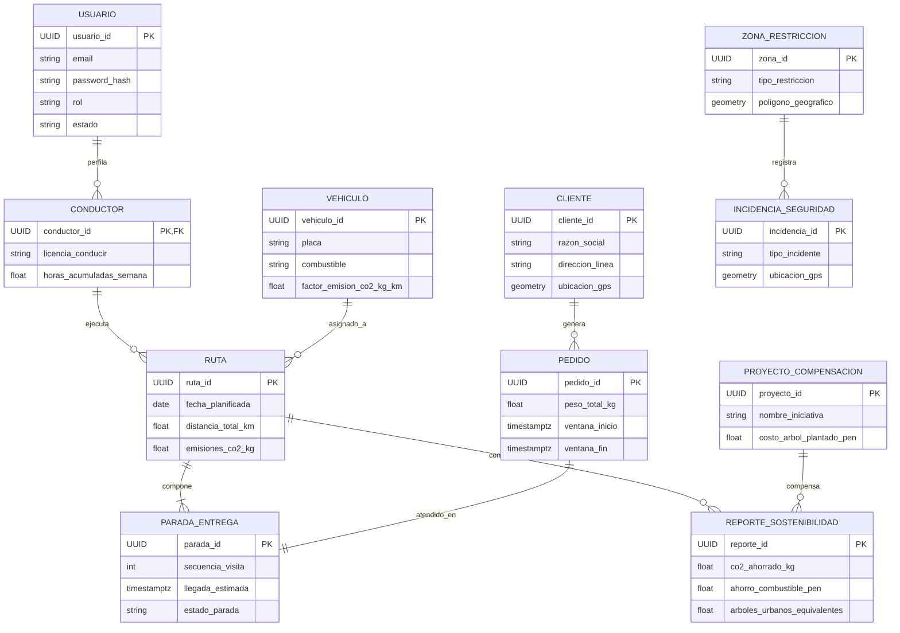

# Documento 11: Diseño e Ingeniería de Base de Datos
 
| **Campo** | **Información** |
|---|---|
| **Sistema** | EcoLogística Lima |
| **Cliente / Operador** | DistriRápido S.A.C. |
| **Versión** | V_1_0_0 |
| **Ruta del archivo** | `docs/01 Inicio/11. Base de datos V_1_0_0.md` |
 
---
 
## 1. Modelo Conceptual
 
El modelo conceptual captura las entidades del problema Green VRPTW (*Vehicle Routing Problem with Time Windows*) para la empresa DistriRápido S.A.C. en los distritos de San Juan de Lurigancho, El Agustino, Santa Anita y Ate. Representa la interacción operativa entre la flota vehicular diésel y a gas natural vehicular (GNV), conductores sujetos a la jornada laboral máxima estipulada en la Ley N.° 30224, pedidos con restricciones temporales para establecimientos comerciales, rutas generadas mediante metaheurísticas, cuantificación de emisiones de CO₂, polígonos de riesgo de tránsito y proyectos de mitigación ecológica urbana.
 
### 1.1. Diagrama Entidad-Relación Conceptual
 

 
---
 
## 2. Modelo Lógico y Normalización (3FN)
 
El diseño lógico satisface las tres primeras formas normales:
 
- **Primera Forma Normal (1FN):** Todos los atributos son atómicos. La dirección de entrega se desglosa en distrito, vía y referencia complementaria. Los datos cartográficos se gestionan mediante geometrías espaciales del estándar OGC a través de los tipos `geometry(Point, 4326)` y `geometry(Polygon, 4326)` de PostGIS.
- **Segunda Forma Normal (2FN):** Toda tabla con clave primaria simple o compuesta garantiza que sus atributos no clave posean dependencia funcional total de dicha clave. En la entidad `paradas_entrega`, las métricas de recorrido y tiempo dependen de la identificación de la parada y la ruta.
- **Tercera Forma Normal (3FN):** No existen dependencias transitivas entre atributos no clave. Las variables económicas y de emisión con variación temporal (precio del galón diésel a S/ 17.50 o tasa de mantenimiento de S/ 1.20 por km) se persisten como registros transaccionales históricos al consolidar cada ruta.
### 2.1. Diccionario de Entidades y Atributos
 
#### Tabla: `usuarios`
 
| Atributo | Tipo de Dato | Restricción | Descripción |
|---|---|---|---|
| usuario_id | UUID | PK, DEFAULT gen_random_uuid() | Identificador único del usuario en el sistema. |
| email | VARCHAR(255) | UNIQUE, NOT NULL | Dirección de correo electrónico para inicio de sesión. |
| password_hash | VARCHAR(255) | NOT NULL | Resumen criptográfico de autenticación (Argon2id/bcrypt). |
| nombre_completo | VARCHAR(150) | NOT NULL | Nombres y apellidos registrados del operador. |
| rol | VARCHAR(30) | NOT NULL, CHECK | Clasificación funcional (ADMINISTRADOR, DESPACHADOR, CONDUCTOR). |
| estado | VARCHAR(20) | NOT NULL, CHECK | Estado del registro (ACTIVO, INACTIVO, BLOQUEADO). |
| creado_en | TIMESTAMPTZ | NOT NULL, DEFAULT NOW() | Fecha y hora de creación de la cuenta (UTC-5). |
 
#### Tabla: `conductores`
 
| Atributo | Tipo de Dato | Restricción | Descripción |
|---|---|---|---|
| conductor_id | UUID | PK, FK -> usuarios(usuario_id) | Enlace referencial a la cuenta de usuario. |
| dni | CHAR(8) | UNIQUE, NOT NULL | Documento Nacional de Identidad bajo Ley N.° 29733. |
| licencia_conducir | VARCHAR(20) | UNIQUE, NOT NULL | Registro de brevete otorgado por el MTC. |
| licencia_categoria | VARCHAR(10) | NOT NULL | Categoría vehicular asignada (ej. A-IIa, A-IIb). |
| telefono | VARCHAR(20) | NOT NULL | Línea telefónica directa para coordinación operativa. |
| direccion_partida | VARCHAR(255) | NOT NULL | Distrito de residencia o centro de salida matutina. |
| ubicacion_partida | geometry(Point, 4326) | NOT NULL | Coordenadas geoespaciales WGS84 de partida del conductor. |
| horas_acumuladas_semana | NUMERIC(5,2) | NOT NULL, DEFAULT 0.00 | Acumulador de horas de conducción según Ley N.° 30224. |
| estado_operativo | VARCHAR(30) | NOT NULL, CHECK | Estado de disponibilidad (DISPONIBLE, EN_RUTA, DESCANSO_OBLIGATORIO, LICENCIA). |
| actualizado_en | TIMESTAMPTZ | NOT NULL, DEFAULT NOW() | Marca temporal de la última actualización de estado. |
 
#### Tabla: `vehiculos`
 
| Atributo | Tipo de Dato | Restricción | Descripción |
|---|---|---|---|
| vehiculo_id | UUID | PK, DEFAULT gen_random_uuid() | Identificador único del vehículo de carga. |
| placa | CHAR(6) | UNIQUE, NOT NULL | Placa de rodaje vehicular oficial. |
| ultimo_digito_placa | SMALLINT | NOT NULL, CHECK (0-9) | Dígito de control para D.S. N.° 033-2012-MTC. |
| tipo_vehiculo | VARCHAR(30) | NOT NULL, CHECK | Tipo de unidad (FURGON, CAMIONETA, MOTO). |
| combustible | VARCHAR(20) | NOT NULL, CHECK | Fuente de energía (DIESEL, GNV, ELECTRICO). |
| capacidad_peso_kg | NUMERIC(8,2) | NOT NULL, CHECK (>0) | Capacidad nominal de carga en kilogramos. |
| capacidad_volumen_m3 | NUMERIC(6,2) | NOT NULL, CHECK (>0) | Capacidad volumétrica interna de carga útil. |
| rendimiento_km_gal | NUMERIC(6,2) | NOT NULL, CHECK (>0) | Rendimiento nominal en kilómetros por galón o m³. |
| factor_emision_co2_kg_km | NUMERIC(6,4) | NOT NULL, CHECK (>=0) | Tasa de emisión directa en kg CO₂/km. |
| costo_mantenimiento_por_km | NUMERIC(6,2) | NOT NULL, DEFAULT 1.20 | Costo de mantenimiento por km (S/ 1.20/km). |
| anio_fabricacion | SMALLINT | NOT NULL, CHECK | Año de fabricación para filtros de emisiones urbanas. |
| activo | BOOLEAN | NOT NULL, DEFAULT TRUE | Indicador binario de operatividad mecánica. |
| creado_en | TIMESTAMPTZ | NOT NULL, DEFAULT NOW() | Fecha y hora de registro de la unidad. |
 
#### Tabla: `clientes`
 
| Atributo | Tipo de Dato | Restricción | Descripción |
|---|---|---|---|
| cliente_id | UUID | PK, DEFAULT gen_random_uuid() | Identificador único del comercio registrado. |
| codigo_comercio | VARCHAR(30) | UNIQUE, NOT NULL | Código interno o número de identificación tributaria (RUC). |
| razon_social | VARCHAR(150) | NOT NULL | Denominación legal o comercial de la bodega. |
| contacto_nombre | VARCHAR(100) | NOT NULL | Nombre de la persona encargada de la recepción física. |
| telefono | VARCHAR(20) | NOT NULL | Número de contacto directo para recepción en punto. |
| distrito | VARCHAR(50) | NOT NULL, CHECK | Jurisdicción (SAN_JUAN_DE_LURIGANCHO, EL_AGUSTINO, SANTA_ANITA, ATE). |
| direccion_linea | VARCHAR(255) | NOT NULL | Descripción de nomenclatura vial y numeración/manzana. |
| referencia_geografica | VARCHAR(255) | NULL | Elementos visuales auxiliares para localización. |
| ubicacion_gps | geometry(Point, 4326) | NOT NULL | Coordenadas de posición georreferenciadas. |
| hora_apertura_regular | TIME | NOT NULL, DEFAULT '06:00:00' | Horario de apertura del comercio. |
| hora_cierre_regular | TIME | NOT NULL, DEFAULT '21:00:00' | Horario de cierre del comercio. |
| creado_en | TIMESTAMPTZ | NOT NULL, DEFAULT NOW() | Fecha y hora de registro del cliente. |
 
#### Tabla: `pedidos`
 
| Atributo | Tipo de Dato | Restricción | Descripción |
|---|---|---|---|
| pedido_id | UUID | PK, DEFAULT gen_random_uuid() | Identificador único de la orden de reparto. |
| cliente_id | UUID | FK -> clientes(cliente_id) | Enlace referencial al punto de despacho. |
| numero_remision | VARCHAR(50) | UNIQUE, NOT NULL | Identificador de la guía de remisión de transporte. |
| peso_total_kg | NUMERIC(8,2) | NOT NULL, CHECK (>0) | Masa total declarada de los bienes solicitados. |
| volumen_total_m3 | NUMERIC(6,2) | NOT NULL, CHECK (>0) | Volumen cubicado del pedido para balance de flota. |
| prioridad | VARCHAR(20) | NOT NULL, CHECK | Jerarquía de atención (EXPRESS, ESTANDAR, ECONOMICO). |
| tipo_producto | VARCHAR(30) | NOT NULL, CHECK | Naturaleza de la carga (PERECEDERO, NO_PERECEDERO). |
| ventana_inicio | TIMESTAMPTZ | NOT NULL | Inicio de la franja horaria requerida para entrega. |
| ventana_fin | TIMESTAMPTZ | NOT NULL, CHECK | Fin estricto de la franja horaria requerida. |
| tiempo_servicio_minutos | SMALLINT | NOT NULL, DEFAULT 10 | Minutos asignados a la descarga en el local. |
| estado | VARCHAR(30) | NOT NULL, CHECK | Estado (PENDIENTE, EN_RUTA, ENTREGADO, FALLIDO_FUERA_VENTANA, CANCELADO). |
| creado_en | TIMESTAMPTZ | NOT NULL, DEFAULT NOW() | Marca temporal de ingreso del pedido al sistema. |
 
#### Tabla: `rutas`
 
| Atributo | Tipo de Dato | Restricción | Descripción |
|---|---|---|---|
| ruta_id | UUID | PK, DEFAULT gen_random_uuid() | Identificador de la solución generada para un vehículo. |
| vehiculo_id | UUID | FK -> vehiculos(vehiculo_id) | Unidad móvil asignada al itinerario. |
| conductor_id | UUID | FK -> conductores(conductor_id) | Chofer responsable del itinerario. |
| fecha_planificada | DATE | NOT NULL | Fecha calendaria para la ejecución del itinerario. |
| algoritmo_utilizado | VARCHAR(50) | NOT NULL | Metaheurística aplicada para resolver el Green VRPTW. |
| tiempo_calculo_segundos | NUMERIC(5,2) | NOT NULL | Tiempo de procesamiento del motor de ruteo. |
| distancia_total_km | NUMERIC(8,2) | NOT NULL, DEFAULT 0.00 | Kilometraje acumulado proyectado para la ruta. |
| tiempo_total_estimado_minutos | INTEGER | NOT NULL, DEFAULT 0 | Duración global estimada de tránsito y servicio. |
| consumo_combustible_gal | NUMERIC(8,2) | NOT NULL, DEFAULT 0.00 | Volumen de combustible proyectado para el viaje. |
| emisiones_co2_kg | NUMERIC(8,2) | NOT NULL, DEFAULT 0.00 | Masa total calculada de CO₂ emitido. |
| trazado_polyline | TEXT | NULL | Coordenadas de la ruta en polilínea codificada. |
| estado_ruta | VARCHAR(30) | NOT NULL, CHECK | Estado (PROGRAMADA, EN_CURSO, REOPTIMIZADA, FINALIZADA, CANCELADA). |
| creado_en | TIMESTAMPTZ | NOT NULL, DEFAULT NOW() | Marca temporal del cálculo de la solución. |
 
#### Tabla: `paradas_entrega`
 
| Atributo | Tipo de Dato | Restricción | Descripción |
|---|---|---|---|
| parada_id | UUID | PK, DEFAULT gen_random_uuid() | Identificador de la escala intermedia en la ruta. |
| ruta_id | UUID | FK -> rutas(ruta_id) | Enlace referencial a la ruta contenedora. |
| pedido_id | UUID | FK -> pedidos(pedido_id) | Orden mercantil asignada a esta parada. |
| secuencia_visita | SMALLINT | NOT NULL, CHECK (>=1) | Posición numérica en la secuencia de despacho. |
| distancia_desde_anterior_km | NUMERIC(6,2) | NOT NULL, DEFAULT 0.00 | Distancia euclidiana o vial desde la parada previa. |
| tiempo_viaje_minutos | NUMERIC(6,2) | NOT NULL, DEFAULT 0.00 | Duración del desplazamiento con datos de tráfico. |
| llegada_estimada | TIMESTAMPTZ | NOT NULL | Hora teórica calculada por el modelo de optimización. |
| llegada_real | TIMESTAMPTZ | NULL | Hora efectiva de arribo registrada en dispositivo. |
| salida_real | TIMESTAMPTZ | NULL | Hora de término de entrega física en el comercio. |
| penalidad_tiempo_pen | NUMERIC(8,2) | NOT NULL, DEFAULT 0.00 | Recargo financiero por arribo fuera de ventana horaria. |
| estado_parada | VARCHAR(30) | NOT NULL, CHECK | Estado (PENDIENTE, COMPLETADA, OMITIDA_DESVIO, INCIDENCIA). |
 
#### Tabla: `reportes_sostenibilidad`
 
| Atributo | Tipo de Dato | Restricción | Descripción |
|---|---|---|---|
| reporte_id | UUID | PK, DEFAULT gen_random_uuid() | Identificador del consolidado analítico ambiental. |
| ruta_id | UUID | UNIQUE, FK -> rutas(ruta_id) | Relación unívoca con la ruta evaluada. |
| distancia_ahorrada_km | NUMERIC(8,2) | NOT NULL | Kilómetros restados a la solución no optimizada. |
| co2_ahorrado_kg | NUMERIC(8,2) | NOT NULL | Kilogramos de CO₂ mitigados mediante la heurística. |
| ahorro_combustible_pen | NUMERIC(8,2) | NOT NULL | Ahorro monetario en combustible (S/ 17.50/galón). |
| ahorro_mantenimiento_pen | NUMERIC(8,2) | NOT NULL | Ahorro monetario por menor desgaste mecánico. |
| arboles_urbanos_equivalentes | NUMERIC(6,2) | NOT NULL | Unidades de árboles requeridos para absorción anual. |
| generado_en | TIMESTAMPTZ | NOT NULL, DEFAULT NOW() | Fecha y hora de cálculo del consolidado. |
 
#### Tabla: `proyectos_compensacion`
 
| Atributo | Tipo de Dato | Restricción | Descripción |
|---|---|---|---|
| proyecto_id | UUID | PK, DEFAULT gen_random_uuid() | Identificador de la iniciativa ambiental asociada. |
| nombre_iniciativa | VARCHAR(150) | UNIQUE, NOT NULL | Nombre formal de la iniciativa de forestación local. |
| entidad_gestora | VARCHAR(150) | NOT NULL | Organismo público administrador (SERPAR, Municipalidad). |
| costo_arbol_plantado_pen | NUMERIC(8,2) | NOT NULL, CHECK (>0) | Costo financiero unitario por árbol plantado. |
| factor_absorcion_co2_kg_anio | NUMERIC(6,2) | NOT NULL, DEFAULT 22.00 | Coeficiente anual de absorción por espécimen. |
| enlace_convenio | VARCHAR(255) | NULL | Enlace institucional al acuerdo de compensación. |
| activo | BOOLEAN | NOT NULL, DEFAULT TRUE | Condición operativa de la alianza ambiental. |
| creado_en | TIMESTAMPTZ | NOT NULL, DEFAULT NOW() | Registro temporal de la alianza en base de datos. |
 
#### Tabla: `zonas_restriccion`
 
| Atributo | Tipo de Dato | Restricción | Descripción |
|---|---|---|---|
| zona_id | UUID | PK, DEFAULT gen_random_uuid() | Identificador del polígono espacial restrictivo. |
| nombre_zona | VARCHAR(100) | NOT NULL | Denominación territorial del sector regulado. |
| tipo_restriccion | VARCHAR(50) | NOT NULL, CHECK | Categoría (DELINCUENCIA_ROBOS, CONGESTION_HORA_PUNTA, AMBIENTAL_EMISIONES, VIA_NO_PAVIMENTADA_TROCHA). |
| poligono_geografico | geometry(Polygon, 4326) | NOT NULL | Coordenadas del polígono en formato PostGIS. |
| hora_inicio_restriccion | TIME | NULL | Inicio de la franja horaria de la restricción. |
| hora_fin_restriccion | TIME | NULL | Fin de la franja horaria de la restricción. |
| penalidad_costo_heuristica | NUMERIC(8,2) | NOT NULL, DEFAULT 100.00 | Ponderación de disuasión en la función objetivo. |
| creado_en | TIMESTAMPTZ | NOT NULL, DEFAULT NOW() | Fecha de delimitación del área geográfica. |
 
#### Tabla: `incidencias_seguridad`
 
| Atributo | Tipo de Dato | Restricción | Descripción |
|---|---|---|---|
| incidencia_id | UUID | PK, DEFAULT gen_random_uuid() | Identificador único del suceso notificado. |
| ruta_id | UUID | FK -> rutas(ruta_id) | Ruta en la cual se originó la contingencia. |
| conductor_id | UUID | FK -> conductores(conductor_id) | Conductor emisor de la alerta operativa. |
| tipo_incidente | VARCHAR(50) | NOT NULL, CHECK | Tipo (CONGESTION_SEVERA, ASALTO_SOSPECHA, ACCIDENTE_PISTA, CORTE_LUZ_FALLA_RED, CALLE_BLOQUEADA). |
| ubicacion_gps | geometry(Point, 4326) | NOT NULL | Coordenada espacial del reporte emitido. |
| descripcion | TEXT | NULL | Detalle textual descriptivo del suceso vial. |
| reportado_en | TIMESTAMPTZ | NOT NULL, DEFAULT NOW() | Fecha y hora exacta de captura de la señal. |
 
---
 
## 3. Modelo Físico (DDL SQL) e Índices
 
```sql
-- Extensiones obligatorias para UUID nativo y operaciones geoespaciales
CREATE EXTENSION IF NOT EXISTS "uuid-ossp";
CREATE EXTENSION IF NOT EXISTS "postgis";
 
-- 1. TABLA: usuarios
CREATE TABLE usuarios (
    usuario_id UUID PRIMARY KEY DEFAULT gen_random_uuid(),
    email VARCHAR(255) NOT NULL UNIQUE,
    password_hash VARCHAR(255) NOT NULL,
    nombre_completo VARCHAR(150) NOT NULL,
    rol VARCHAR(30) NOT NULL CHECK (rol IN ('ADMINISTRADOR', 'DESPACHADOR', 'CONDUCTOR')),
    estado VARCHAR(20) NOT NULL DEFAULT 'ACTIVO' CHECK (estado IN ('ACTIVO', 'INACTIVO', 'BLOQUEADO')),
    creado_en TIMESTAMP WITH TIME ZONE DEFAULT CURRENT_TIMESTAMP
);
 
CREATE INDEX idx_usuarios_email ON usuarios(email);
CREATE INDEX idx_usuarios_rol ON usuarios(rol);
 
-- 2. TABLA: conductores
CREATE TABLE conductores (
    conductor_id UUID PRIMARY KEY REFERENCES usuarios(usuario_id) ON DELETE RESTRICT,
    dni CHAR(8) NOT NULL UNIQUE,
    licencia_conducir VARCHAR(20) NOT NULL UNIQUE,
    licencia_categoria VARCHAR(10) NOT NULL,
    telefono VARCHAR(20) NOT NULL,
    direccion_partida VARCHAR(255) NOT NULL,
    ubicacion_partida geometry(Point, 4326) NOT NULL,
    horas_acumuladas_semana NUMERIC(5, 2) NOT NULL DEFAULT 0.00 CHECK (horas_acumuladas_semana >= 0.00),
    estado_operativo VARCHAR(30) NOT NULL DEFAULT 'DISPONIBLE'
        CHECK (estado_operativo IN ('DISPONIBLE', 'EN_RUTA', 'DESCANSO_OBLIGATORIO', 'LICENCIA')),
    actualizado_en TIMESTAMP WITH TIME ZONE DEFAULT CURRENT_TIMESTAMP
);
 
CREATE INDEX idx_conductores_dni ON conductores(dni);
CREATE INDEX idx_conductores_estado ON conductores(estado_operativo);
CREATE INDEX idx_conductores_ubicacion_partida ON conductores USING GIST(ubicacion_partida);
 
-- 3. TABLA: vehiculos
CREATE TABLE vehiculos (
    vehiculo_id UUID PRIMARY KEY DEFAULT gen_random_uuid(),
    placa CHAR(6) NOT NULL UNIQUE,
    ultimo_digito_placa SMALLINT NOT NULL CHECK (ultimo_digito_placa BETWEEN 0 AND 9),
    tipo_vehiculo VARCHAR(30) NOT NULL CHECK (tipo_vehiculo IN ('FURGON', 'CAMIONETA', 'MOTO')),
    combustible VARCHAR(20) NOT NULL CHECK (combustible IN ('DIESEL', 'GNV', 'ELECTRICO')),
    capacidad_peso_kg NUMERIC(8, 2) NOT NULL CHECK (capacidad_peso_kg > 0),
    capacidad_volumen_m3 NUMERIC(6, 2) NOT NULL CHECK (capacidad_volumen_m3 > 0),
    rendimiento_km_gal NUMERIC(6, 2) NOT NULL CHECK (rendimiento_km_gal > 0),
    factor_emision_co2_kg_km NUMERIC(6, 4) NOT NULL CHECK (factor_emision_co2_kg_km >= 0),
    costo_mantenimiento_por_km NUMERIC(6, 2) NOT NULL DEFAULT 1.20,
    anio_fabricacion SMALLINT NOT NULL CHECK (anio_fabricacion BETWEEN 1995 AND 2030),
    activo BOOLEAN NOT NULL DEFAULT TRUE,
    creado_en TIMESTAMP WITH TIME ZONE DEFAULT CURRENT_TIMESTAMP
);
 
CREATE INDEX idx_vehiculos_placa ON vehiculos(placa);
CREATE INDEX idx_vehiculos_ultimo_digito ON vehiculos(ultimo_digito_placa);
CREATE INDEX idx_vehiculos_combustible_activo ON vehiculos(combustible, activo);
 
-- 4. TABLA: clientes
CREATE TABLE clientes (
    cliente_id UUID PRIMARY KEY DEFAULT gen_random_uuid(),
    codigo_comercio VARCHAR(30) NOT NULL UNIQUE,
    razon_social VARCHAR(150) NOT NULL,
    contacto_nombre VARCHAR(100) NOT NULL,
    telefono VARCHAR(20) NOT NULL,
    distrito VARCHAR(50) NOT NULL CHECK (distrito IN ('SAN_JUAN_DE_LURIGANCHO', 'EL_AGUSTINO', 'SANTA_ANITA', 'ATE')),
    direccion_linea VARCHAR(255) NOT NULL,
    referencia_geografica VARCHAR(255),
    ubicacion_gps geometry(Point, 4326) NOT NULL,
    hora_apertura_regular TIME NOT NULL DEFAULT '06:00:00',
    hora_cierre_regular TIME NOT NULL DEFAULT '21:00:00',
    creado_en TIMESTAMP WITH TIME ZONE DEFAULT CURRENT_TIMESTAMP
);
 
CREATE INDEX idx_clientes_distrito ON clientes(distrito);
CREATE INDEX idx_clientes_ubicacion_gps ON clientes USING GIST(ubicacion_gps);
 
-- 5. TABLA: pedidos
CREATE TABLE pedidos (
    pedido_id UUID PRIMARY KEY DEFAULT gen_random_uuid(),
    cliente_id UUID NOT NULL REFERENCES clientes(cliente_id) ON DELETE RESTRICT,
    numero_remision VARCHAR(50) NOT NULL UNIQUE,
    peso_total_kg NUMERIC(8, 2) NOT NULL CHECK (peso_total_kg > 0),
    volumen_total_m3 NUMERIC(6, 2) NOT NULL CHECK (volumen_total_m3 > 0),
    prioridad VARCHAR(20) NOT NULL DEFAULT 'ESTANDAR' CHECK (prioridad IN ('EXPRESS', 'ESTANDAR', 'ECONOMICO')),
    tipo_producto VARCHAR(30) NOT NULL DEFAULT 'NO_PERECEDERO' CHECK (tipo_producto IN ('PERECEDERO', 'NO_PERECEDERO')),
    ventana_inicio TIMESTAMP WITH TIME ZONE NOT NULL,
    ventana_fin TIMESTAMP WITH TIME ZONE NOT NULL,
    tiempo_servicio_minutos SMALLINT NOT NULL DEFAULT 10,
    estado VARCHAR(30) NOT NULL DEFAULT 'PENDIENTE'
        CHECK (estado IN ('PENDIENTE', 'EN_RUTA', 'ENTREGADO', 'FALLIDO_FUERA_VENTANA', 'CANCELADO')),
    creado_en TIMESTAMP WITH TIME ZONE DEFAULT CURRENT_TIMESTAMP,
    CONSTRAINT chk_pedidos_ventanas CHECK (ventana_fin > ventana_inicio)
);
 
CREATE INDEX idx_pedidos_cliente ON pedidos(cliente_id);
CREATE INDEX idx_pedidos_estado ON pedidos(estado);
CREATE INDEX idx_pedidos_ventanas ON pedidos(ventana_inicio, ventana_fin);
 
-- 6. TABLA: rutas
CREATE TABLE rutas (
    ruta_id UUID PRIMARY KEY DEFAULT gen_random_uuid(),
    vehiculo_id UUID NOT NULL REFERENCES vehiculos(vehiculo_id) ON DELETE RESTRICT,
    conductor_id UUID NOT NULL REFERENCES conductores(conductor_id) ON DELETE RESTRICT,
    fecha_planificada DATE NOT NULL,
    algoritmo_utilizado VARCHAR(50) NOT NULL,
    tiempo_calculo_segundos NUMERIC(5, 2) NOT NULL,
    distancia_total_km NUMERIC(8, 2) NOT NULL DEFAULT 0.00,
    tiempo_total_estimado_minutos INTEGER NOT NULL DEFAULT 0,
    consumo_combustible_gal NUMERIC(8, 2) NOT NULL DEFAULT 0.00,
    emisiones_co2_kg NUMERIC(8, 2) NOT NULL DEFAULT 0.00,
    trazado_polyline TEXT,
    estado_ruta VARCHAR(30) NOT NULL DEFAULT 'PROGRAMADA'
        CHECK (estado_ruta IN ('PROGRAMADA', 'EN_CURSO', 'REOPTIMIZADA', 'FINALIZADA', 'CANCELADA')),
    creado_en TIMESTAMP WITH TIME ZONE DEFAULT CURRENT_TIMESTAMP
);
 
CREATE INDEX idx_rutas_fecha ON rutas(fecha_planificada);
CREATE INDEX idx_rutas_conductor_fecha ON rutas(conductor_id, fecha_planificada);
CREATE INDEX idx_rutas_vehiculo_fecha ON rutas(vehiculo_id, fecha_planificada);
 
-- 7. TABLA: paradas_entrega
CREATE TABLE paradas_entrega (
    parada_id UUID PRIMARY KEY DEFAULT gen_random_uuid(),
    ruta_id UUID NOT NULL REFERENCES rutas(ruta_id) ON DELETE CASCADE,
    pedido_id UUID NOT NULL REFERENCES pedidos(pedido_id) ON DELETE RESTRICT,
    secuencia_visita SMALLINT NOT NULL CHECK (secuencia_visita >= 1),
    distancia_desde_anterior_km NUMERIC(6, 2) NOT NULL DEFAULT 0.00,
    tiempo_viaje_minutos NUMERIC(6, 2) NOT NULL DEFAULT 0.00,
    llegada_estimada TIMESTAMP WITH TIME ZONE NOT NULL,
    llegada_real TIMESTAMP WITH TIME ZONE,
    salida_real TIMESTAMP WITH TIME ZONE,
    penalidad_tiempo_pen NUMERIC(8, 2) NOT NULL DEFAULT 0.00,
    estado_parada VARCHAR(30) NOT NULL DEFAULT 'PENDIENTE'
        CHECK (estado_parada IN ('PENDIENTE', 'COMPLETADA', 'OMITIDA_DESVIO', 'INCIDENCIA')),
    CONSTRAINT uq_ruta_secuencia UNIQUE (ruta_id, secuencia_visita),
    CONSTRAINT uq_ruta_pedido UNIQUE (ruta_id, pedido_id)
);
 
CREATE INDEX idx_paradas_ruta_secuencia ON paradas_entrega(ruta_id, secuencia_visita);
CREATE INDEX idx_paradas_pedido ON paradas_entrega(pedido_id);
 
-- 8. TABLA: reportes_sostenibilidad
CREATE TABLE reportes_sostenibilidad (
    reporte_id UUID PRIMARY KEY DEFAULT gen_random_uuid(),
    ruta_id UUID NOT NULL UNIQUE REFERENCES rutas(ruta_id) ON DELETE CASCADE,
    distancia_ahorrada_km NUMERIC(8, 2) NOT NULL,
    co2_ahorrado_kg NUMERIC(8, 2) NOT NULL,
    ahorro_combustible_pen NUMERIC(8, 2) NOT NULL,
    ahorro_mantenimiento_pen NUMERIC(8, 2) NOT NULL,
    arboles_urbanos_equivalentes NUMERIC(6, 2) NOT NULL,
    generado_en TIMESTAMP WITH TIME ZONE DEFAULT CURRENT_TIMESTAMP
);
 
CREATE INDEX idx_reportes_ruta ON reportes_sostenibilidad(ruta_id);
 
-- 9. TABLA: proyectos_compensacion
CREATE TABLE proyectos_compensacion (
    proyecto_id UUID PRIMARY KEY DEFAULT gen_random_uuid(),
    nombre_iniciativa VARCHAR(150) NOT NULL UNIQUE,
    entidad_gestora VARCHAR(150) NOT NULL,
    costo_arbol_plantado_pen NUMERIC(8, 2) NOT NULL CHECK (costo_arbol_plantado_pen > 0),
    factor_absorcion_co2_kg_anio NUMERIC(6, 2) NOT NULL DEFAULT 22.00,
    enlace_convenio VARCHAR(255),
    activo BOOLEAN NOT NULL DEFAULT TRUE,
    creado_en TIMESTAMP WITH TIME ZONE DEFAULT CURRENT_TIMESTAMP
);
 
-- 10. TABLA: zonas_restriccion
CREATE TABLE zonas_restriccion (
    zona_id UUID PRIMARY KEY DEFAULT gen_random_uuid(),
    nombre_zona VARCHAR(100) NOT NULL,
    tipo_restriccion VARCHAR(50) NOT NULL
        CHECK (tipo_restriccion IN ('DELINCUENCIA_ROBOS', 'CONGESTION_HORA_PUNTA', 'AMBIENTAL_EMISIONES', 'VIA_NO_PAVIMENTADA_TROCHA')),
    poligono_geografico geometry(Polygon, 4326) NOT NULL,
    hora_inicio_restriccion TIME,
    hora_fin_restriccion TIME,
    penalidad_costo_heuristica NUMERIC(8, 2) NOT NULL DEFAULT 100.00 CHECK (penalidad_costo_heuristica >= 0),
    creado_en TIMESTAMP WITH TIME ZONE DEFAULT CURRENT_TIMESTAMP
);
 
CREATE INDEX idx_zonas_poligono ON zonas_restriccion USING GIST(poligono_geografico);
CREATE INDEX idx_zonas_tipo ON zonas_restriccion(tipo_restriccion);
 
-- 11. TABLA: incidencias_seguridad
CREATE TABLE incidencias_seguridad (
    incidencia_id UUID PRIMARY KEY DEFAULT gen_random_uuid(),
    ruta_id UUID NOT NULL REFERENCES rutas(ruta_id) ON DELETE CASCADE,
    conductor_id UUID NOT NULL REFERENCES conductores(conductor_id) ON DELETE RESTRICT,
    tipo_incidente VARCHAR(50) NOT NULL CHECK (tipo_incidente IN ('CONGESTION_SEVERA', 'ASALTO_SOSPECHA', 'ACCIDENTE_PISTA', 'CORTE_LUZ_FALLA_RED', 'CALLE_BLOQUEADA')),
    ubicacion_gps geometry(Point, 4326) NOT NULL,
    descripcion TEXT,
    reportado_en TIMESTAMP WITH TIME ZONE DEFAULT CURRENT_TIMESTAMP
);
 
CREATE INDEX idx_incidencias_ruta ON incidencias_seguridad(ruta_id);
CREATE INDEX idx_incidencias_gps ON incidencias_seguridad USING GIST(ubicacion_gps);
```
 
### 3.1. Justificación de Índices y Optimización de Consultas
 
- **Índices Geoespaciales GiST (GIST):** Establecidos en `clientes(ubicacion_gps)`, `conductores(ubicacion_partida)`, `zonas_restriccion(poligono_geografico)` e `incidencias_seguridad(ubicacion_gps)`. Habilitan la evaluación de operaciones de proximidad e inclusión espacial (`ST_DWithin`, `ST_Contains`, `ST_Intersects`) en orden de complejidad computacional logarítmico O(log n), evitando escaneos secuenciales de tabla al calcular matrices de distancia geográfica.
- **Índice B-Tree Compuesto en `pedidos(ventana_inicio, ventana_fin)`:** Permite la selección y particionamiento de pedidos por rangos temporales en menos de 10 milisegundos, suministrando al algoritmo de optimización las ventanas horarias de bodegas y evitando el 22 % de entregas fuera de plazo.
- **Índices B-Tree en `vehiculos(ultimo_digito_placa)` y `(combustible, activo)`:** Optimizan la consulta de filtrado de unidades autorizadas para circulación conforme al cronograma de restricción vehicular del Decreto Supremo N.° 033-2012-MTC y criterios de transición energética.
- **Restricciones de Unicidad en `paradas_entrega`:** Las restricciones compuestas `uq_ruta_secuencia (ruta_id, secuencia_visita)` y `uq_ruta_pedido (ruta_id, pedido_id)` garantizan desde el motor relacional que la metaheurística no genere órdenes de visita redundantes ni duplique pedidos dentro de una misma ruta operativa.
---
 
## Historial de Versiones
 
| Versión | Fecha | Descripción del Cambio |
|---|---|---|
| V_1_0_0 | 04/09/2026 | Versión inicial del documento de diseño e ingeniería de base de datos. |