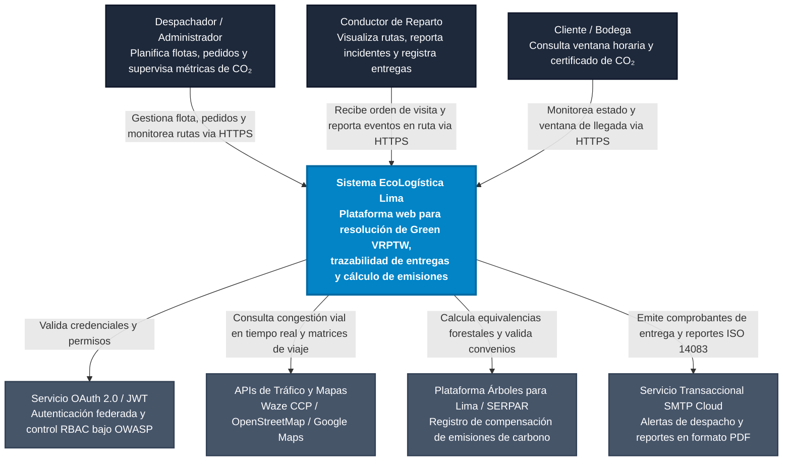
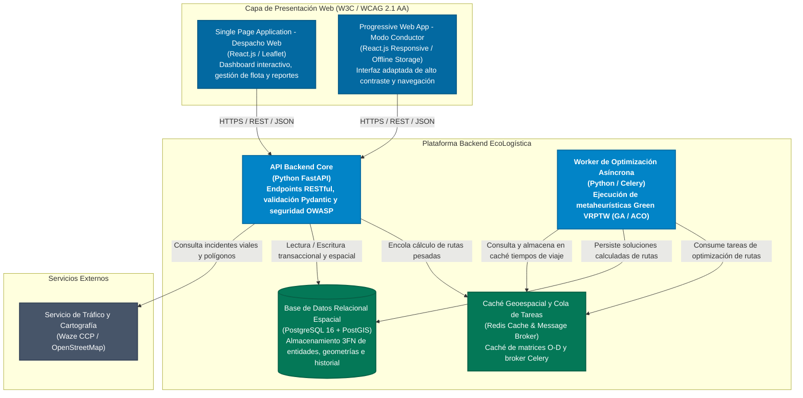
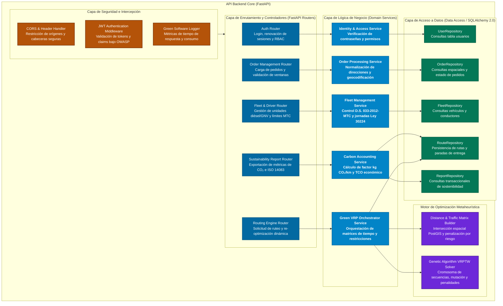

# Documento 12: Arquitectura de Software - Modelo C4
 
| **Campo** | **Información** |
|---|---|
| **Sistema** | EcoLogística Lima |
| **Cliente / Operador** | DistriRápido S.A.C. |
| **Versión** | V_1_0_0 |
| **Ruta del archivo** | `docs/01 Inicio/12. Modelo C4 V_1_0_0.md` |
 
---
 
## 1. Nivel 1: Diagrama de Contexto del Sistema
 
El diagrama de contexto delimita las fronteras del sistema **EcoLogística Lima** para el operador **DistriRápido S.A.C.**, ilustrando las interacciones con los actores humanos y las plataformas externas de tráfico, geolocalización, normativas de transporte y servicios de compensación ambiental en Lima Metropolitana.
 

 
---
 
## 2. Nivel 2: Diagrama de Contenedores
 
El diagrama de contenedores describe la topología de la plataforma, detallando las aplicaciones front-end, los servicios de procesamiento de la API web construida en FastAPI, los mecanismos de optimización mediante colas asíncronas y los almacenes de datos relacionales y en memoria conforme a los estándares Green Software e ISO/IEC 25010.
 

 
---
 
## 3. Nivel 3: Diagrama de Componentes de la API Backend
 
El diagrama de componentes descompone internamente el contenedor **API Backend Core (FastAPI)**, evidenciando la arquitectura en capas (Controladores, Middlewares de Seguridad, Capa de Servicio de Negocio, Repositorios de Acceso a Datos y Motor Heurístico) que garantiza alta cohesión y bajo acoplamiento.
 

 
---
 
## 4. Descripción de Componentes Clave y Decisiones Arquitecturales
 
### 4.1. Módulos del Sistema
 
- **Auth & Security Layer:** Implementa autenticación stateless mediante JWT cifrados con HMAC-SHA256 bajo especificaciones OWASP Top 10. Aplica control de acceso basado en roles (ADMINISTRADOR, DESPACHADOR, CONDUCTOR) para asegurar que los choferes únicamente lean la ruta asignada a su identificador.
- **Green VRP Orchestrator & Genetic Algorithm Solver:** Resuelve el Problema de Ruteo de Vehículos con Ventanas de Tiempo considerando criterios de sostenibilidad ecológica. Evalúa en su función de aptitud la distancia euclidiana/vial, el factor de emisión vehicular (diésel vs. GNV), la penalización monetaria por retraso en bodegas y la elusión de áreas declaradas como zonas de alta criminalidad o vías no pavimentadas en Lima Este.
- **Carbon Accounting & Life-Cycle Costing Engine:** Transforma los kilómetros ejecutados en masa de dióxido de carbono mitigada y calcula el Costo Total de Propiedad (TCO) integrando los costos de combustible diésel (S/ 17.50/galón) y mantenimiento operativo (S/ 1.20/km), generando la equivalencia de reforestación para el programa "Árboles para Lima".
### 4.2. Cumplimiento de Atributos de Calidad y Estándares
 
- **Rendimiento (RNF-01):** La separación de tareas pesadas hacia Celery y Redis desacopla el hilo de ejecución principal de FastAPI, garantizando respuestas menores a 45 segundos para instancias de hasta 150 pedidos y 15 vehículos, y resolviendo re-optimizaciones en menos de 30 segundos.
- **Green Software:** Se reduce la transferencia de datos y consumo de cómputo en la nube mediante almacenamiento en caché Redis para matrices origen-destino de Lima Este, evitando consultas redundantes a APIs externas y minimizando la huella energética del software.
- **Accesibilidad y Usabilidad (RNF-03, RNF-05, WCAG 2.1 AA):** El contenedor PWA (Modo Conductor) está desacoplado para proporcionar navegación táctil simplificada, contraste accesible y tolerancia a la intermitencia de red mediante service workers en zonas periféricas de San Juan de Lurigancho.
---
 
## Historial de Versiones
 
| Versión | Fecha | Descripción del Cambio |
|---|---|---|
| V_1_0_0 | — | Versión inicial del documento de arquitectura de software - Modelo C4. |
 