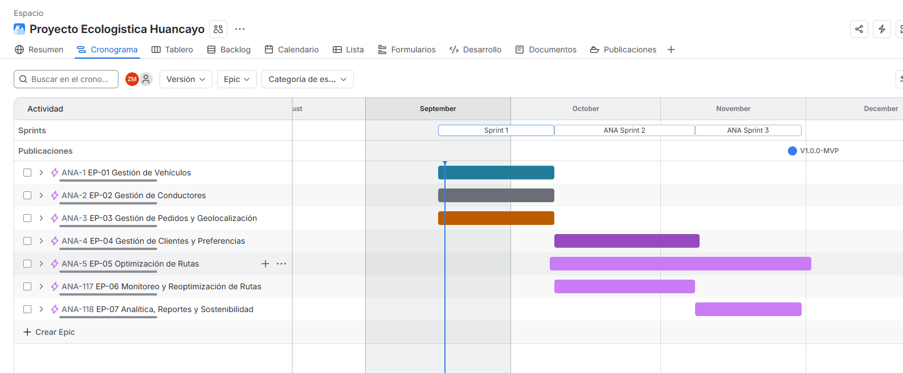
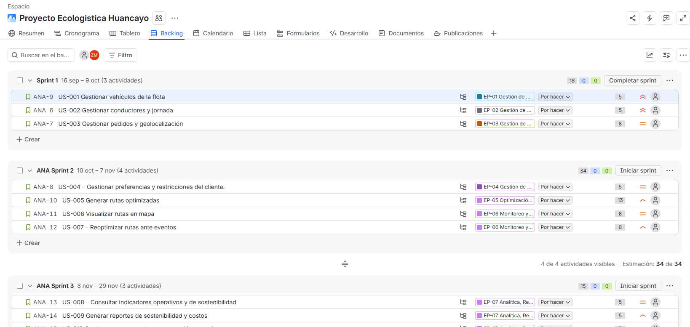
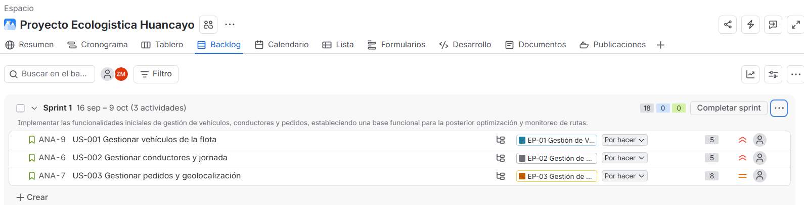
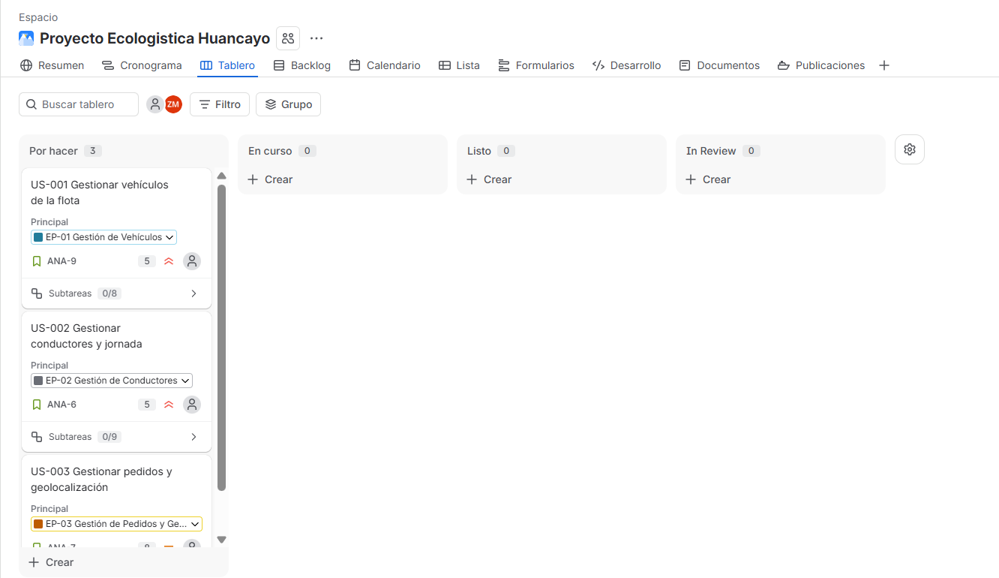
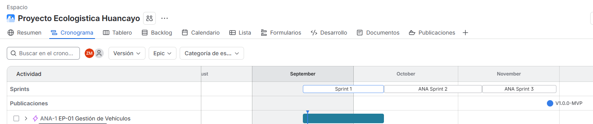
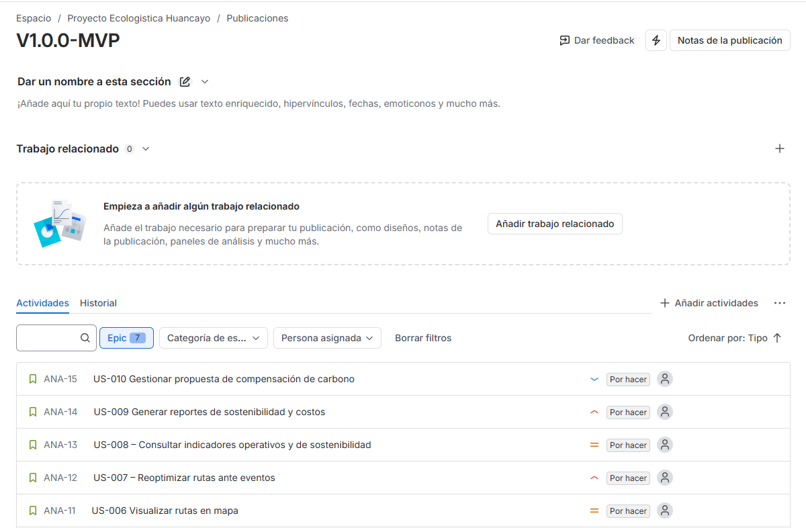

[← Volver al README Principal](../../README.md)

# 02. Artefacto Jira 

---

## 1. Información del documento

| Campo | Detalle |
| :--- | :--- |
| **Nombre del Proyecto** | EcoLogistica-Lima: Plataforma Web y Móvil para la Gestión y Optimización de Logística Verde Urbana |
| **Código del Proyecto** | PFA-ECOLIMA-2026 |
| **Integrantes del Equipo** | • Zayuri Cerron Medina  • Jheferson Martinez Valerio  • Angela Rojas Quispe  • Maylit Mendoza Alarcon  • Diego Angulo Gonzales  |
| **Responsable del Documento**| Zayuri Cerron Medina |
| **Fecha de Elaboración** | 4 de septiembre de 2026 |
| **Versión** | 1.0.0 |

---

# 2.`Artefactos Jira V_1_0_0.md`

Este artefacto presenta la configuración realizada en ****Jira Software**** para organizar y gestionar el proyecto ****EcoLogística Lima**** mediante la metodología Scrum. La parametrización permite visualizar el trabajo del equipo a través de épicas, historias de usuario, tareas y subtareas, además de establecer prioridades, estimaciones y versiones del proyecto.

Para este artefacto se configuraron los elementos principales del proyecto en Jira, considerando la estructura definida previamente en los documentos de requisitos y planificación. Las historias de usuario fueron asociadas a sus respectivas épicas y se les asignaron prioridades y Story Points, permitiendo organizar el trabajo pendiente y planificar los Sprint de manera ordenada.

Asimismo, se configuró el tablero Scrum para realizar el seguimiento del avance de las actividades mediante los estados ****To Do****, ****In Progress****, ****In Review / QA**** y ****Done****. También se consideró la planificación del ****Sprint 1****, incluyendo los elementos seleccionados y la definición de su respectiva meta.

Las siguientes evidencias muestran únicamente los elementos correspondientes a Jira Software, manteniendo los recortes centrados en el panel o sección que se desea demostrar.

## Evidencia 1: Roadmap del Proyecto

En esta evidencia se muestra el ****Roadmap del proyecto****, donde se visualiza la distribución de las épicas dentro de una línea de tiempo. Esta configuración permite identificar la organización general del proyecto y observar cómo se planifican las diferentes funcionalidades que serán desarrolladas durante el proyecto.

## Evidencia 2: Backlog Priorizado

En esta evidencia se presenta el ****Backlog del proyecto****, donde se muestran las historias de usuario organizadas según su prioridad. También se visualizan los ****Story Points**** asignados para estimar el esfuerzo de cada historia y los componentes relacionados con cada elemento.

Esta vista permite comprobar que los requerimientos fueron trasladados a Jira y organizados para facilitar la planificación y seguimiento del trabajo del equipo.

## Evidencia 3: Sprint Planning & Sprint Goal

En esta evidencia se muestra la planificación correspondiente al ****Sprint 1****, incluyendo las historias de usuario y demás elementos seleccionados para ser desarrollados durante el Sprint.

También se presenta el ****Sprint Goal****, el cual establece la meta principal que orienta el trabajo del equipo durante este periodo. La planificación permite identificar los elementos comprometidos y mantener un objetivo común para el Sprint.

## Evidencia 4: Tablero Scrum Activo

En esta evidencia se presenta el ****tablero Scrum activo de Jira****, donde las actividades del Sprint se encuentran distribuidas de acuerdo con su estado de avance.

Se consideran las columnas ****To Do****, ****In Progress****, ****In Review / QA**** y ****Done****, permitiendo realizar un seguimiento visual del trabajo pendiente, en desarrollo, en revisión y finalizado.

La utilización de este tablero facilita el control del avance de las historias, tareas y subtareas asignadas al equipo durante el Sprint.

## Evidencia 5: Gestión de Versiones / Release

En esta evidencia se muestra el módulo ****Releases**** de Jira, donde se presenta la versión creada para el proyecto y las historias asociadas a dicha versión.

La configuración de versiones permite organizar los elementos que forman parte de una entrega y realizar un seguimiento del trabajo relacionado con cada release. De esta manera, las historias de usuario pueden vincularse con una versión específica del proyecto.

## Conclusión del artefacto

Las evidencias presentadas permiten comprobar la parametrización realizada en Jira Software para la gestión del proyecto ****EcoLogística Lima****. La configuración integra el roadmap, backlog, planificación del Sprint, tablero Scrum y gestión de versiones, permitiendo organizar y realizar seguimiento de las actividades definidas para el desarrollo del proyecto.

[← Volver al README Principal](../../README.md)
